**ToolKit**

**Οδηγός Διαχείρισης Λογισμικού, Περιεχομένου, Δεδομένων και Μελετών**

Σκοπός του παρόντος οδηγού
==========================

Στη μελέτη αυτή παρέχεται ένας πρακτικός οδηγός που αφορά στη διαχείριση
και απόθεση α) λογισμικού, β) δεδομένων, γ) περιεχομένου, καθώς και δ)
μελετών για δημόσιους φορείς και οργανισμούς στην Ελλάδα. Ο τεχνικός
αυτός οδηγός προέκυψε για κάθε μία από τις παραπάνω περιπτώσεις κατόπιν
επισκόπησης της υφιστάμενης κατάστασης με άμεση αναφορά σε καλές
πρακτικές και αποδεκτές λύσεις ΕΛ/ΛΑΚ που έχουν υιοθετηθεί από πολύ
γνωστούς δημόσιους φορείς ανά την υφήλιο.

Η μελέτη καταλήγει σε συγκεκριμένες προτάσεις που συνάδουν με τις
έννοιες της “ανοικτότητας” των δεδομένων (open data) και του ελεύθερου
λογισμικού / λογισμικού ανοικτού κώδικα (open source / open code). Πέραν
της καλής πρακτικής σε αντίστοιχους δημόσιους φορείς και δράσεις στο
εξωτερικό, οι προτάσεις της μελέτης αυτής τεκμηριώνονται και βάσει του
θεσμικού / νομοθετικού πλαισίου στην Ελλάδα.

Στα παραρτήματα που αποτελούν βασικό μέρος του παρόντος toolkit,
αναλύονται -με όσο το δυνατόν απλό και περιγραφικό τρόπο- τα βήματα τα
οποία χρειάζονται για την εγγραφή, την απόθεση και διαχείριση
λογισμικού, περιεχομένου, δεδομένων, και μελετών έργων από έναν φορέα
χρήστη.

Προτάσεις
==========

Στο κεφάλαιο 2 παρέχεται μία σύντομη μελέτη που αφορά στη διαχείριση και
απόθεση **λογισμικού** για δημόσιους φορείς και οργανισμούς στην
Ελλάδα.. Η μελέτη *προτείνει την χρήση του GitHub*, ως της κατ’ εξοχήν
καλύτερης υιοθετημένης λύσης για την τεκμηρίωση και απόθεση λογισμικού
στην κοινότητα παγκοσμίως.

Στο κεφάλαιο 3, παρέχεται μία σύντομη μελέτη που αφορά στη διαχείριση
και απόθεση **περιεχομένου** για δημόσιους φορείς και οργανισμούς στην
Ελλάδα. *Προτείνεται η χρήση των Wikimedia Commons, καθώς και του
Flickr*. Και για τις δύο προτάσεις υπάρχει μεγάλη διαλειτουργικότητα με
τις πλέον γνωστές αδειοδοτήσεις ανοικτού περιεχομένου.

Στο κεφάλαιο 4, αντίστοιχα με τα προηγούμενα κεφάλαια, παρέχεται μία
σύντομη μελέτη που αφορά στη διαχείριση και απόθεση ***δεδομένων*** για
δημόσιους φορείς και οργανισμούς στην Ελλάδα. Η μελέτη *προτείνει την
χρήση της πλατφόρμας data.gov.gr.* Η πλατφόρμα αυτή αποτελεί εδώ και
αρκετό διάστημα τον κεντρικό κατάλογο και αποθετήριο όσον αφορά τα
δημόσια δεδομένα φορέων της ελληνικής κυβέρνησης, κινούμενη παράλληλα
σύμφωνα με τις διεθνείς καλές πρακτικές και οδηγίες. Υπάρχει δε
εξαιρετική διαλειτουργικότητα σε επίπεδο υποστήριξης και με το GitHub
(πρόταση για απόθεση και τεκμηρίωση λογισμικού).

Τέλος, το κεφάλαιο 5 περιγράφει μία σύντομη μελέτη που αφορά στη
διαχείριση και απόθεση **μελετών**, καθώς και **μελετών σχεδίων** για
δημόσιους φορείς και οργανισμούς στην Ελλάδα. *Προτείνεται η χρήση του
Αποθετηρίου Κατάθεσης Μελετών Δημοσίου, καθώς και του GrabCAD*
αντίστοιχα. Για την περίπτωση του Αποθετηρίου Κατάθεσης Μελετών Δημοσίου
υπάρχει ισχυρό θεσμικό και νομικό πλαίσιο στην Ελλάδα για την υποστήριξή
του, ενώ κρίνεται απαραίτητη η ενδυνάμωση της χρήσης του από δημόσιους
φορείς δημοσίου, καθώς και από φορείς της τοπικής αυτοδιοίκησης. Από την
άλλη, η πλατφόρμα GrabCAD, έχει μεγάλη διείσδυση στο χώρο των μηχανικών
σε παγκόσμια κλίμακα.

Οι παραπάνω μελέτες και προτάσεις προέκυψαν κατόπιν επισκόπησης της
υφιστάμενης κατάστασης με άμεση αναφορά σε καλές πρακτικές και αποδεκτές
λύσεις ΕΛ/ΛΑΚ που έχουν υιοθετηθεί από πολύ γνωστούς δημόσιους φορείς
ανά την υφήλιο.

Τέλος, συμπληρωματικά με όλες τις παραπάνω διαστάσεις και προτάσεις
(απόθεση λογισμικού, περιεχομένου, δεδομένων, μελετών), συνίσταται η
ύπαρξη μίας πολιτικής εφεδρικών αντιγράφων ανάλογα με τον φορέα.

1. Εισαγωγή
==========================================================================================================

1.1 Ανάγκη για Ανοικτά Δεδομένα και Λογισμικό
-------------------------------------------------------------------------------------------------------------------------------------------

Στην σημερινή εποχή τα επονομαζόμενα «Ανοικτά Δεδομένα» (Open Data)
αποτελούν ένα μεγάλο αποθετήριο γνώσης το οποίο μπορεί να χρησιμοποιηθεί
για την βελτίωση διαδικασιών και την επίλυση προβλημάτων στον χώρο της
Ηλεκτρονικής Διακυβέρνησης των επιχειρήσεις, των δημοσίων οργανισμών,
καθώς και στην καθημερινή ζωή του πολίτη. Τα ανοικτά δεδομένα εμπλέκουν
διάφορους τομείς της Πληροφορικής, όπως διαχείριση Πληροφορίας, Τεχνητή
Νοημοσύνη, Εφαρμογές Διαδικτύου, καθώς και άλλες επιστήμες όπως την
Νομική, τα Μαθηματικά και την Στατιστική, την Οικονομική επιστήμη και
την Κοινωνιολογία.

Το Διαδίκτυο και ο Παγκόσμιος Ιστός (Web) αποτελούν τους ακρογωνιαίους
λίθους για την διάθεση αυτών των δεδομένων, υπό την έννοια ότι η έλλειψη
ενός εκ των δύο αυτόματα καταργεί τις ιδιότητες της ανοικτότητας, της
διασύνδεσης και της επεξεργασίας τους. Επιπλέον, οι υπολογιστές και τα
προγράμματα θα μπορούν να δομούν το περιεχόμενο και να ανταλλάσσουν
δεδομένα μεταξύ τους, καθιστώντας την πληροφορία μηχαναγνώσιμη και
μοναδικά προσδιορίσιμη. Έτσι χρήστες-πολίτες, φορείς, λογισμικό και
πληροφορία θα αποτελούν ένα δυναμικό οικοσύστημα με αυξημένη
διαλειτουργικότητα.

Παράλληλα, από την κοινωνία των πολιτών διαφαίνεται με ολοένα και
μεγαλύτερο ρυθμό η ανάγκη διάθεση πληροφορίας για την επίλυση κοινωνικών
ζητημάτων όπως η διαφάνεια, η βέλτιστη διαχείριση (και εξοικονόμηση)
πόρων, η αειφορία και άλλες κοινωνικές διεργασίες.

Προς τον στόχο της ικανοποίησης των αναγκών αυτών αποθετήρια δεδομένων
με ανοικτό λογισμικό (π.χ.[*CKAN*](http://ckan.org/)), λειτουργούν ως ενιαία
σημεία διάθεσης, διαμοιρασμού και επεξεργασίας δεδομένων, και ως ένας
προτυποποιημένος μηχανισμός διαλειτουργικότητας για διεσπαρμένες και
ετερογενείς πηγές δεδομένων. Παρόλα αυτά, έχουν αρχίσει να διαφαίνονται
νέες τεχνολογίες και πρωτόκολλα (π.χ.[*OData
protocol*](http://www.odata.org/)) τα οποία υπόσχονται
διαλειτουργικότητα μεταξύ διαφορετικών πηγών πληροφορίας, όμως δεν έχουν
κερδίσει ακόμα το ευρύ κοινό ούτε αναφέρονται σε μία συγκεκριμένη
θεματική περιοχή, καταστώντας έτσι δύσκολη την εφαρμογή τους σε κοινά
προβλήματα.

Το άνοιγμα των δημοσίων δεδομένων αποτελεί βασικό ζητούμενο για την
ανάπτυξη, για τη διαλειτουργικότητα και τη διαφάνεια στη δημόσια
διοίκηση, καθώς και για την εκπαίδευση και την έρευνα. Η διάθεση των
δεδομένων στους πολίτες σχετικά με δημόσια έργα, μελέτες και έρευνες,
δίνουν την αίσθηση της άμεσης ανταπόδοσης των φόρων τους, αυξάνοντας
παράλληλα τη λογοδοσία των φορέων υλοποίησης. Τρανό παράδειγμα είναι το
πρόγραμμα «ΔΙ@ΥΓΕΙΑ» που αποτελεί την κορωνίδα του οικοσυστήματος
Ανοικτών Κυβερνητικών Δεδομένων στην Ελλάδα και μία από τις πιο
προοδευτικές και αξιόλογες προσπάθειες για την καταπολέμηση της
διαφθοράς σε παγκόσμιο επίπεδο, διότι διαμέσου αυτής παρέχεται σχεδόν το
σύνολο των αποφάσεων της Ελληνικής Δημόσιας διοίκησης σε μηχαναγνώσιμη
μορφή. Τέλος σύμφωνα με υπάρχουσες μελέτες διαφαίνονται οφέλη μέσω της
δημιουργίας νέων θέσεων απασχόλησης στην αγορά, με μείωση του κόστους
και αποδοτικότερη λειτουργία στις δημόσιες υπηρεσίες και φορείς.

1.2 Υφιστάμενη Κατάσταση ανά την υφήλιο και την Ευρώπη
----------------------------------------------------------------------------------------------------------------------------------------------------

Η εκρηκτική αύξηση της προσφοράς "ανοικτότητας" στα δεδομένα έχει
επηρεάσει αρκετές κυβερνήσεις σε παγκόσμιο επίπεδο. Σε μία πρωτοφανή
εξάπλωση συναφών πρωτοβουλιών πάνω από 50 κυβερνήσεις ανοίγουν ολοένα
και περισσότερο τα δεδομένα που αφορούν τους δημόσιους οργανισμούς και
τους φορείς τους. Ακόμα και χώρες υπό ανάπτυξη, δημοσιεύουν σύνολα
δεδομένων που αφορούν κυβερνητικές αποφάσεις ιδιαίτερα όταν αποσκοπούν
στην ενίσχυση της ανάπτυξής τους σε συγκεκριμένους τομείς (η Ινδία λ.χ.
δημοσιεύει περί τα 3.500 σύνολα δεδομένων, η πλειονότητα των οποίων
αφορά πληροφορία για τη γεωργία). Ο διεθνής οργανισμός World Wide Web
Foundation με βάση τον Web Index και τον [*Open Data
Index*](http://index.okfn.org/) αξιολογεί τις κυβερνήσεις ανά την υφήλιο
βάσει 14 μετρικών αξιολόγησης διαμοιρασμού/διασύνδεσης και διάθεσης
δεδομένων τοποθετώντας το Ηνωμένο Βασίλειο, τις ΗΠΑ., τη Δανία, τη
Νορβηγία και την Ολλανδία στις 5 κορυφαίες θέσεις.

Πιο συγκεκριμένα στις Η.Π.Α. η κυβέρνηση δημοσιεύει κυβερνητικά δεδομένα
στο διαδικτυακό τόπο data.gov (περίπου 100.000 σύνολα ανοικτών
δεδομένων) από μία ευρύτατη γκάμα θεματικών περιοχών. Στη Μ. Βρετανία
στο διαδικτυακό τόπο data.gov.uk περιέχονται πάνω από 2.500 σύνολα
δεδομένων.

Τέλος, παρόμοιες κυβερνητικές πρωτοβουλίες έχουν ξεκινήσει και σε
λιγότερο αναπτυγμένες χώρες όπως είναι για παράδειγμα η Κένυα. Βάσει μία
μελέτης, η οποία υποστήριζε ότι το άνοιγμα συγκεκριμένων δεδομένων που
αφορούν προκηρύξεις δημοσίων έργων μπορεί να οδηγήσει σε όφελος της
τάξεων του 1 δισεκατομμύριο δολαρίων ετησίως, η κυβέρνηση διέθεσε τα
αντίστοιχα δεδομένα μέσα στο 2011. Η υπόθεση επιβεβαιώθηκε σε πολύ
μεγάλο βαθμό και έκτοτε η κυβέρνηση επέκτεινε τη διάθεση και άλλων
κυβερνητικών δεδομένων.

1.3 Υφιστάμενη κατάσταση στην Ελλάδα – Πράξεις
----------------------------------------------

### 1.3.1 ΔΙΑΥΓΕΙΑ

Από τα κορυφαία δείγματα της Ελληνικής προσπάθειας για “άνοιγμα”
δεδομένων προς το ευρύ κοινό. Το Πρόγραμμα Δι@ύγεια (Νόμος
[3861/2010](https://diavgeia.gov.gr/info)) στοχεύει στην επίτευξη της
μέγιστης δυνατής δημοσιότητας της κυβερνητικής πολιτικής και της
διοικητικής δραστηριότητας, τη διασφάλιση της διαφάνειας και την
εμπέδωση της υπευθυνότητας και της λογοδοσίας από την πλευρά των φορέων
άσκησης της δημόσιας εξουσίας. Από την 10η Ιουνίου 2014 έχει τεθεί σε
λειτουργία η νέα λειτουργικότητα του Προγράμματος Διαύγεια ([ΔΙΑΥΓΕΙΑ
ΙΙ](https://diavgeia.gov.gr/info)). Είναι αξιοσημείωτο να επισημανθεί
ότι μόνο η Ελλάδα (λόγω της ΔΙΑΥΓΕΙΑΣ) και η Μ. Βρετανία είναι οι
εξέχουσες χώρες κατά τον [Open Data Index](http://index.okfn.org/) στην
διάθεση πληροφορίας σχετικά με αποφάσεις δαπανών.

### 1.3.2 data.gov.gr

Αποτελεί τον κεντρικό κατάλογο όσον αφορά δημόσια δεδομένα από φορείς
της ελληνικής κυβέρνησης. Αποσκοπεί στην παροχή συνόλων δεδομένων με
πληρότητα και ακρίβεια σε μηχαναγνώσιμα πρότυπα, καθώς και στην παροχή
διαδικτυακών υπηρεσιών προς τους πολίτες και άλλα ενδιάμεσα συστήματα
πληροφοριών. Μέχρι σήμερα υποστηρίζει περίπου 500 σύνολα δεδομένων από
60 περίπου δημόσιους φορείς και οργανισμούς. Η αύξηση των συνόλων είναι
εκρηκτική, καθώς τον τελευταίο χρόνο (μέχρι την συγγραφή του παρόντος)
έχει περίπου δεκαπλασιάσει τα αποτεθημένα σύνολα δεδομένων.
Υποστηρίζεται από τον Ν.
[*3448/2006*](http://www.et.gr/idocs-nph/search/pdfViewerForm.html?args=5C7QrtC22wFGQ40gSLPFOXdtvSoClrL8KoqaERu8wDDtIl9LGdkF53UIxsx942CdyqxSQYNuqAGCF0IfB9HI6qSYtMQEkEHLwnFqmgJSA5WIsluV-nRwO1oKqSe4BlOTSpEWYhszF8P8UqWb_zFijM7pZ0uAVJnEIRDT8gfgjDrktnVRzo5d-fi1RvYPzP-4)
και τον
[*4305/2014*](http://www.et.gr/idocs-nph/search/pdfViewerForm.html?args=5C7QrtC22wEc63YDhn5AeXdtvSoClrL8oeKAuTKOuiV5MXD0LzQTLWPU9yLzB8V68knBzLCmTXKaO6fpVZ6Lx3UnKl3nP8NxdnJ5r9cmWyJWelDvWS_18kAEhATUkJb0x1LIdQ163nV9K--td6SIubMfH2r_a2DXjO6MJnF-5f9_LW7pRMszX0fGIINVmMIh)
περί της περαιτέρω χρήση πληροφοριών του δημόσιου τομέα και τη ρύθμιση
θεμάτων αρμοδιότητας Υπουργείου Εσωτερικών, Δημόσιας Διοίκησης και
Αποκέντρωσης, καθώς και της ανοικτής διάθεσης και περαιτέρω χρήσης
εγγράφων, πληροφοριών και δεδομένων του δημόσιου τομέα.

### 1.3.3 Εθνική Υποδομή Γεωχωρικών Πληροφοριών

Η Εθνική Υποδομή Γεωχωρικών Πληροφοριών (ΕΥΓΕΠ) αποτελεί σύστημα το
οποίο επιτρέπει την άμεση πρόσβαση στο σύνολο της ψηφιακά διαθέσιμης
γεωπληροφορίας της χώρας και για το σύνολο της επικράτειάς της, μέσω του
διαδικτύου. Η δημιουργία της ΕΥΓΕΠ θεσμοθετήθηκε τον Σεπτέμβριο 2010 με
το Νόμο
[*3882/2010*](https://nomoi.info/%CE%A6%CE%95%CE%9A-%CE%91-166-2010-%CF%83%CE%B5%CE%BB-1.html)
(ΦΕΚ 166 Ά) «Εθνική Υποδομή Γεωχωρικών Πληροφοριών - Εναρμόνιση με την
Οδηγία 2007/2/ΕΚ του Ευρωπαϊκού Κοινοβουλίου και του Συμβουλίου της 14ης
Μαρτίου 2007 και άλλες διατάξεις. Τροποποίηση του Ν. 1647/1986
«[*Οργανισμός Κτηματολογίου και Χαρτογραφήσεων
Ελλάδας*](http://www.inspire.okxe.gr/) (ΟΚΧΕ) και άλλες διατάξεις»
(Α΄141)».

### 1.3.4 Κεντρικό Ηλεκτρονικό Μητρώο για τις προμήθειες του ευρύτερου Δημοσίου Τομέα

Ο σκοπός του Εθνικού Συστήματος Ηλεκτρονικών Δημοσίων Συμβάσεων
([*Ε.Σ.Η.ΔΗ.Σ.*](http://www.eaadhsy.gr/index.php/m-foreis/m-eshdhs))
είναι να πραγματοποιείται ηλεκτρονικά όλη η διαγωνιστική διαδικασία και
η παρακολούθηση μίας δημόσιας σύμβασης με προϋπολογισμό 60.000 ευρώ και
άνω άνευ ΦΠΑ. Υποστηρίζονται λειτουργίες που αφορούν την κατάρτιση και
δημοσίευση της διακήρυξης ενός διαγωνισμού, την υποβολή των προσφορών
από τους υποψήφιους αναδόχους, καθώς και την αξιολόγηση και την
κατακύρωση της σύμβασης. Βασίζεται στο Νόμο
[*4155/2013*](http://www.et.gr/idocs-nph/search/pdfViewerForm.html?args=5C7QrtC22wEaosRGzKxO6XdtvSoClrL8Z8EAZX8QMQ95MXD0LzQTLWPU9yLzB8V68knBzLCmTXKaO6fpVZ6Lx3UnKl3nP8NxdnJ5r9cmWyJWelDvWS_18kAEhATUkJb0x1LIdQ163nV9K--td6SIuaGafZsB51W3Q59ZLtQJ_fvNASePXHIXvslaTkL6oNvD)
(ΦΕΚ 120/Α/2013) που ορίζεται το πλαίσιο αλλά και το αρχικό
χρονοδιάγραμμα λειτουργίας του συστήματος.

### 1.3.5 Αποθετήριο Μελετών Δημοσίου Τομέα

Το [*Αποθετήριο Μελετών Δημοσίου
Τομέα*](http://resources.ekdd.gr/knowledge/) απευθύνεται στους δημόσιους
φορείς (σε δοκιμαστική λειτουργία) και βασίζεται στον Νόμο
[*3966/2011*](http://resources.ekdd.gr/knowledge/files/3966_2011_nomos_apothetiriou_mtk.pdf).
Αντίστοιχο χώρος με έμφαση στην έρευνα είναι το [*Αποθετήριο Διοικητικής
Γνώσης*](http://www.ekdd.gr/ekdda/index.php/gr/2012-06-19-09-30-23) το
οποίο είναι ανοικτό στην κοινωνία και ιδιαίτερα στην ακαδημαϊκή και
ερευνητική κοινότητα. Υποστηρίζει μελέτες και έρευνες που υποχρεωτικά
κοινοποιούν υπηρεσίες και φορείς του δημοσίου, καθώς και εκθέσεις που
προκύπτουν από δημόσια διαβούλευση ή προκύπτουν από την εγχώρια και
διεθνή ακαδημαϊκή και ερευνητική κοινότητα.

1.4 Υφιστάμενη κατάσταση στην Ελλάδα - Νομικό/Θεσμικό Πλαίσιο
-----------------------------------------------------------------------------------------------------------------------------------------------------------

Η υφιστάμενη κατάσταση στην Ελλάδα κρίνεται ιδιαίτερα ικανοποιητική όσον
αφορά το θεσμικό και νομικό πλαίσιο για την απόθεση και διάθεση ανοικτών
δημόσιων δεδομένων, καθώς και για την υποστήριξη και ενίσχυση της
ανοικτότητας των δημοσίων δεδομένων. Πιο συγκεκριμένα οι νόμοι και οι
σχετικές εγκύκλιοι και διατάξεις, καθώς και σχέδια δράσης μπορούν να
συνοψιστούν στον παρακάτω πίνακα.

  ----------------------------------------------------------------------------------------------------------------------------------------------------------------------------------------------------------------------------------------------------------------------------------------------------------------------------------------------------------------------------------------------------------------------------------------------------------------------------------------- -----------------------------------------------------------------------------------------------------------------------------------------------------------------------------------------------------------------------------------------------------------------------------
  Νόμος Πλαίσιο για την Ηλεκτρονική Διακυβέρνηση                                                                                                                                                                                                                                                                                                                                                                                                                                            [*Ν.3979/2011*](http://www.et.gr/idocs-nph/search/pdfViewerForm.html?args=5C7QrtC22wFYAFdDx4L2G3dtvSoClrL8aRmGcrk2DyZ5MXD0LzQTLWPU9yLzB8V68knBzLCmTXKaO6fpVZ6Lx3UnKl3nP8NxdnJ5r9cmWyJWelDvWS_18kAEhATUkJb0x1LIdQ163nV9K--td6SIuWul0aw7wuQu_zIv4zGsWeDDAhtceLHtRKuKtY2AHivR)
  Νόμος για τα Ανοιχτά Δεδομένα του δημόσιου τομέα                                                                                                                                                                                                                                                                                                                                                                                                                                          [*Ν.4305/2014*](https://mycontent.ellak.gr/wp-content/uploads/2014/11/N4305_2014.pdf)
  Το σχέδιο δράσης της Ελλάδας για την ανοιχτή διακυβέρνηση                                                                                                                                                                                                                                                                                                                                                                                                                                 [*http://www.opengovpartnership.org/country/greece/action-plan*](http://www.opengovpartnership.org/country/greece/action-plan)
  Το Πρόγραμμα Δι@ύγεια                                                                                                                                                                                                                                                                                                                                                                                                                                                                     [*Ν.3861/2010*](https://diavgeia.gov.gr/info)
  Νόμος για την περαιτέρω χρήση πληροφοριών του δημόσιου τομέα και τη ρύθμιση θεμάτων αρμοδιότητας Υπουργείου Εσωτερικών, Δημόσιας Διοίκησης και Αποκέντρωσης                                                                                                                                                                                                                                                                                                                               [*N.3448/2006*](http://www.et.gr/idocs-nph/search/pdfViewerForm.html?args=5C7QrtC22wFGQ40gSLPFOXdtvSoClrL8KoqaERu8wDDtIl9LGdkF53UIxsx942CdyqxSQYNuqAGCF0IfB9HI6qSYtMQEkEHLwnFqmgJSA5WIsluV-nRwO1oKqSe4BlOTSpEWYhszF8P8UqWb_zFijM7pZ0uAVJnEIRDT8gfgjDrktnVRzo5d-fi1RvYPzP-4)
  Αριθ. ΔΗΔ/Φ.40/407/8.1.2015 εγκύκλιος με θέμα «Εφαρμογή των διατάξεων του Κεφαλαίου Α’ του ν. 4305/2014 (ΦΕΚ 237/Α΄ ) σχετικά με την «ανοικτή διάθεση και περαιτέρω χρήση εγγράφων, πληροφοριών και δεδομένων του δημόσιου τομέα, την τροποποίηση των διατάξεων του πρώτου κεφαλαίου του ν. 3448/2006, προσαρμογή της εθνικής νομοθεσίας στις διατάξεις της οδηγίας 2013/37 του Ευρωπαϊκού Κοινοβουλίου και του Συμβουλίου και την περαιτέρω ενίσχυση της διαφάνειας στο δημόσιο τομέα»   [*https://diavgeia.gov.gr/decision/view/ΩΩΡΜΧ-ΜΒΛ*](https://diavgeia.gov.gr/decision/view/%CE%A9%CE%A9%CE%A1%CE%9C%CE%A7-%CE%9C%CE%92%CE%9B)
  Αριθ. ΔΗΔ. Φ./ 19710/16.6.2015 εγκύκλιο με θέμα «Ανοικτή διάθεση και περαιτέρω χρήση εγγράφων, πληροφοριών και δεδομένων του δημόσιου τομέα σύμφωνα με το κεφ. Α΄ του Ν. 4305/2014»                                                                                                                                                                                                                                                                                                       [*https://diavgeia.gov.gr/decision/view/7ΧΩΨ465ΦΘΕ-Β2Ι*](https://diavgeia.gov.gr/decision/view/7%CE%A7%CE%A9%CE%A8465%CE%A6%CE%98%CE%95-%CE%922%CE%99)
  «Εθνική Υποδομή Γεωχωρικών Πληροφοριών - Εναρμόνιση με την Οδηγία 2007/2/ΕΚ του Ευρωπαϊκού Κοινοβουλίου και του Συμβουλίου της 14ης Μαρτίου 2007 και άλλες διατάξεις. Τροποποίηση του Ν. 1647/1986 «[*Οργανισμός Κτηματολογίου και Χαρτογραφήσεων Ελλάδας*](http://www.inspire.okxe.gr/) (ΟΚΧΕ) και άλλες διατάξεις» (Α΄141)                                                                                                                                                              [*Ν.3882/2010*](https://nomoi.info/%CE%A6%CE%95%CE%9A-%CE%91-166-2010-%CF%83%CE%B5%CE%BB-1.html)
  Εθνικό Σύστημα Ηλεκτρονικών Δημοσίων Συμβάσεων και άλλες διατάξεις.                                                                                                                                                                                                                                                                                                                                                                                                                       [*Ν.4155/2013*](http://www.et.gr/idocs-nph/search/pdfViewerForm.html?args=5C7QrtC22wEaosRGzKxO6XdtvSoClrL8Z8EAZX8QMQ95MXD0LzQTLWPU9yLzB8V68knBzLCmTXKaO6fpVZ6Lx3UnKl3nP8NxdnJ5r9cmWyJWelDvWS_18kAEhATUkJb0x1LIdQ163nV9K--td6SIuaGafZsB51W3Q59ZLtQJ_fvNASePXHIXvslaTkL6oNvD)
  Κανονιστική Πράξη - «Τεχνικές λεπτομέρειες και διαδικασίες λειτουργίας του Εθνικού Συστήματος Ηλεκτρονικών Δημοσίων Συμβάσεων (Ε.Σ.Η.ΔΗ.Σ.)»                                                                                                                                                                                                                                                                                                                                              [*https://www.diavgeia.gov.gr/decision/view/ΒΛΛΥΦ-6Φ1*](https://www.diavgeia.gov.gr/decision/view/%CE%92%CE%9B%CE%9B%CE%A5%CE%A6-6%CE%A61)
  Αποθετήριο Μελετών Δημοσίου Τομέα                                                                                                                                                                                                                                                                                                                                                                                                                                                         [*Ν.3966/2011*](http://resources.ekdd.gr/knowledge/files/3966_2011_nomos_apothetiriou_mtk.pdf)
  ----------------------------------------------------------------------------------------------------------------------------------------------------------------------------------------------------------------------------------------------------------------------------------------------------------------------------------------------------------------------------------------------------------------------------------------------------------------------------------------- -----------------------------------------------------------------------------------------------------------------------------------------------------------------------------------------------------------------------------------------------------------------------------

2. Οδηγός Διαχείρισης Λογισμικού
==============================================================================================================================

Σε αυτήν την ενότητα παρέχεται μία σύντομη μελέτη που αφορά στη
διαχείριση και απόθεση λογισμικού για δημόσιους φορείς και οργανισμούς
στην Ελλάδα. Η μελέτη προέκυψε κατόπιν επισκόπησης της υφιστάμενης
κατάστασης με άμεση αναφορά σε καλές πρακτικές και αποδεκτές λύσεις
ΕΛ/ΛΑΚ που έχουν υιοθετηθεί από πολύ γνωστούς δημόσιους φορείς ανά την
υφήλιο.

Η μελέτη προτείνει την χρήση του GitHub τεκμηριώνοντας την επιλογή αυτή
βάσει και του υπάρχοντος θεσμικού/νομοθετικού πλαισίου στην Ελλάδα.

Στο Παράρτημα Α.1 που αποτελεί βασικό μέρος της παρούσας ενότητας
αναλύονται -με όσο το δυνατόν απλό και περιγραφικό τρόπο- τα βήματα τα
οποία χρειάζονται για την εγγραφή, την απόθεση και διαχείριση λογισμικού
από έναν φορέα χρήστη.

2.1 GitHub
--------------------------------------------------------------------------------------------------------

Το GitHub είναι μία διαδικτυακή υπηρεσία που βάσει της τεχνολογίας git
δίνει τη δυνατότητα στα μέλη της κοινότητας ανοιχτού λογισμικού να
εναποθέτουν, να τεκμηριώνουν και να διαχειρίζονται τα έργα τους.
Επιπλέον, η συγκεκριμένη υπηρεσία αποσκοπεί στο διαμοιρασμό των έργων
στην κοινότητα του ελεύθερου λογισμικού.

2.2 Καλές πρακτικές από διεθνή εμπειρία
-------------------------------------------------------------------------------------------------------------------------------------

Στην υποενότητα αυτή παρουσιάζονται καλές πρακτικές χρήσης και
παραδείγματα από την Βόρεια Αμερική (Η.Π.Α. και Καναδάς).

### Καναδάς

Στην μελέτη που παρουσιάζεται στο παρακάτω URL διαφαίνεται η σχεδόν
καθολική αποδοχή του GitHub σε ό,τι έχει να κάνει με απόθεση, διαχείριση
και διάθεση λογισμικού για εφαρμογές ηλεκτρονικής διακυβέρνησης στον
Καναδά. Επιπλέον περισσότερες πληροφορίες παρουσιάζονται στην εργασία
“GitHub use in public administration in Canada: Early experience with a
new open collaboration tool”, Canadian Public Administration,
(http://onlinelibrary.wiley.com/journal/10.1111/(ISSN)1754-7121).

[*https://jlphd.wordpress.com/2014/07/11/use-of-github-in-public-administration-in-canada-research-project/*](https://jlphd.wordpress.com/2014/07/11/use-of-github-in-public-administration-in-canada-research-project/)

### Η.Π.Α.

-   Federal Spending Transparency - DATA (Digital Accountability
    and Transparency) Act

-   FFATA (Federal Funding Accountability and Transparency) -
    Collaboration Space in GitHub

Στις 31 Αυγούστου του 2015 συγκεκριμένες αρχές που ασχολούνται με
ζητήματα διαχείρισης οικονομικών υποθέσεων και διαφάνειας (Office of
Management and Budget, Department of the Treasury) διέθεσαν μέσω της
πλατφόρμας GitHub 57 προτυποποιήσεις δεδομένων και αντίστοιχο λογισμικό
που σχετίζονται με υπηρεσίες ηλεκτρονικής διακυβέρνησης. Ο σκοπός ήταν
να δημιουργηθεί ένας δημόσιος και ανοικτός χώρος διαβούλευσης για
σχολιασμό και ενίσχυση των προτυποποιήσεων. Περισσότερες πληροφορίες στο
παρακάτω URL.

[*http://fedspendingtransparency.github.io/feedback/*](http://fedspendingtransparency.github.io/feedback/)

-   Consumer Financial Protection Bureau

Σε μία προσπάθεια να διαβεβαιώσει ότι οι αγορές καταναλωτικών
χρηματοπιστωτικών προϊόντων είναι διαφανείς και να ενισχύσει παράλληλα
τον ανταγωνισμό, το αντίστοιχο υπουργείο (Consumer Financial Protection
Bureau) “άνοιξε” πηγές, δεδομένα και λογισμικό στη διάθεση πολιτών και
άλλων δημοσίων φορέων. Περισσότερες πληροφορίες στο παρακάτω URL.

[*http://cfpb.github.io/*](http://cfpb.github.io/)

Τέλος οι παρακάτω πίνακες αποτυπώνουν τη διείσδυση της χρήσης του GitHub
τόσο σε επίπεδο γενικής κυβέρνησης των Η.Π.Α. όσο και των ομόσπονδων
πολιτειών αυτής. Πιο συγκεκριμένα ο Πίνακας 1 αποτυπώνει τον απόλυτο
αριθμό των δημοσιευμένων αποθετηρίων, ενώ ο Πίνακας 2 αποτυπώνει τον
τύπος των δεδομένων / λογισμικού στο GitHub ανάλογα με τον τύπο της
εποπτευόμενης αρχής που ανέβασε το εν λόγω υλικό. Περισσότερες
πληροφορίες στην εργασία “Introducing Open Collaboration in the Public
Sector: The Case of Social Coding on Github”, 2014 European Group of
Public Administration (EGPA) Annual Conference, Speyer (Germany),
September 10-12, 2014.

  ---------------------------------------------------- -------------------------------------------------------
  Πίνακας 1. Αποθετήρια σε GitHub (απόλυτος αριθμός)
  Συνολικά αποθετήρια της γενικής κυβέρνησης
  Τύποι αποθετηρίων ομόσπονδων πολιτειών
  ---------------------------------------------------- -------------------------------------------------------

  -------------------------------------------------------------------------------- ------------------------------------------------------------
  Πίνακας 2. Τύπος κώδικα στο GitHub ανάλογα με τον τύπο της εποπτευόμενης αρχής
  Ρυθμιστικές αρχές και υπουργεία
  Επιστημονικά και ερευνητικά ιδρύματα (π.χ. πανεπιστήμια, ινστιτούτα)
  Υπηρεσίες και αρχές υγείας
  Αρχές άμυνας και εθνικής ασφάλειας
  -------------------------------------------------------------------------------- ------------------------------------------------------------

2.3 Θεσμικό Πλαίσιο
-----------------------------------------------------------------------------------------------------------------

Πέραν του ώριμου νομικού / θεσμικού πλαισίου στην Ελλάδα που ευνοεί την
απόθεση κώδικα και κατ’ επέκταση λογισμικού, οι όροι λειτουργίας του
GitHub επιτρέπουν την αδειοδότηση του κώδικα είτε μέσω συγκεκριμένων
αδειών χρήσης βάσει του Open Source Initiative (δες αναλυτικά τις άδειες
στο <https://opensource.org/licenses/category>), είτε βάσει
συγκεκριμένης άδειας που ορίζει ο ιδιοκτήτης-παραγωγός του
εναποτεθειμένου κώδικα (συνήθως μέσω ενός ευδιάκριτου αρχείου "LICENSE",
"LICENSE.txt", "LICENSE.pdf", κ.λπ.).

Στο Παράρτημα Α.2 αναφέρονται ενδεικτικά κάποια ήδη άδειας για χρήση στο
GitHub.

2.4 Πρόταση
---------------------------------------------------------------------------------------------------------

Βάσει του υπάρχοντος νομοθετικού και θεσμικού πλαισίου, καθώς επίσης και
των περιπτώσεων καλής πρακτικής προτείνεται η χρήση του GitHub για
θέματα διαχείρισης λογισμικού. Οδηγίες χρήσης του GitHub παρατίθενται
στο Παράρτημα Α.1.

3. Οδηγός Διαχείρισης Περιεχομένου
================================================================================================================================

Σε αυτήν την ενότητα παρέχεται μία σύντομη μελέτη που αφορά στη
διαχείριση και απόθεση περιεχομένου για δημόσιους φορείς και οργανισμούς
στην Ελλάδα. Η μελέτη προέκυψε κατόπιν επισκόπησης της υφιστάμενης
κατάστασης με άμεση αναφορά σε καλές πρακτικές και αποδεκτές λύσεις
ΕΛ/ΛΑΚ που έχουν υιοθετηθεί από πολύ γνωστούς δημόσιους φορείς ανά την
υφήλιο.

Η μελέτη προτείνει την χρήση των Wikimedia Commons και εναλλακτικά του
Flickr τεκμηριώνοντας τις επιλογές αυτές βάσει και του υπάρχοντος
θεσμικού/νομοθετικού πλαισίου στην Ελλάδα.

Στα Παραρτήματα Β.1 και Β.2 που αποτελούν βασικό μέρος της παρούσας
ενότητας αναλύονται -με όσο το δυνατόν απλό και περιγραφικό τρόπο- τα
βήματα τα οποία χρειάζονται για την εγγραφή, την απόθεση και διαχείριση
λογισμικού από έναν φορέα χρήστη των Wikimedia Commons και Flickr.

3.1 Wikimedia Commons
-------------------------------------------------------------------------------------------------------------------

Τα Wikimedia Commons συνιστά ένα διαδικτυακό αποθετήριο πολυμεσικών
αρχείων πολυμέσων για ελεύθερης χρήσης. Τα αρχεία αυτά διαμοιράζονται
κάτω από τις άδειες creative commons (δες υποενότητα 3.4.1).

[*https://commons.wikimedia.org/wiki/Commons:Reusing\_content\_outside\_Wikimedia*](https://commons.wikimedia.org/wiki/Commons:Reusing_content_outside_Wikimedia)

3.2 Flickr
--------------------------------------------------------------------------------------------------------

Ένα άλλο ευρύτατα διαδεδομένο αποθετήριο για πολυμεσικό υλικό είναι το
Flickr. Λόγω της μεγάλης δημοφιλίας της θεωρείται από τα πλέον εύρωστα
μέσα κοινωνικής δικτύωσης (υποστηρίζεται από τη Yahoo!) επιτρέποντας σε
χρήστες να επισημαίνουν πληροφορίες πάνω στο αποτεθημένο υλικό μέσω των
ιδιοτήτων του πληθοπορισμού (crowdsourcing). Αυτό της δίνει ένα μικρό
προβάδισμα σε ενδεχόμενη χρήση, καθώς δυνητικά εμπλέκει ενεργά και τους
πολίτες (κοινωνικά δίκτυα - ενεργοί πολίτες). Ορισμένες κυβερνήσεις ανά
την υφήλιο αποθέτουν πολυμεσικό υλικό συνήθως σύμφωνα με τις άδειες κατά
CC.

3.3 Καλές πρακτικές και παραδείγματα
----------------------------------------------------------------------------------------------------------------------------------

### 3.3.1 Wikimedia Commons

Υπάρχει ευρύτατη αποδοχή των wikimedia commons σε κυβερνήσεις ανά την
υφήλιο.

*Η.Π.Α.*

Το 2010 η κυβέρνηση των Η.Π.Α. αποφάσισε, σύμφωνα με το Open Government
Plan
([*OGP*](http://www.archives.gov/open/open-government-plan-1.0.pdf)), να
αποθέσει εθνικά αρχεία (έγγραφα, εικόνες και πολυμεσικό περιεχόμενο) από
διάφορους κυβερνητικούς φορείς και αρχές μέσω των Wikimedia Commons.
Μέχρι το 2012 είχαν αποτεθεί και τεκμηριωθεί περί τις 100.000 ψηφιακές
εικόνες ενώ πάνω 1 δισεκατομμύριο επισκέψεις είχαν τα συνολικά
αποτεθημένα και τεκμηριωμένα έγγραφα (U.S. National Archives and Record
Administration - NARA). Ενδεικτικά των παραδειγμάτων καλής πρακτικής
είναι τα παρακάτω URLs.

[*http://techcrunch.com/2014/06/30/us-national-archives-to-upload-all-holdings-to-wikimedia-commons/*](http://techcrunch.com/2014/06/30/us-national-archives-to-upload-all-holdings-to-wikimedia-commons/)

[*https://en.wikipedia.org/wiki/Wikipedia:Wikipedia\_Signpost/2014-06-25/News\_and\_notes*](https://en.wikipedia.org/wiki/Wikipedia:Wikipedia_Signpost/2014-06-25/News_and_notes)

[*http://dcinno.streetwise.co/2014/07/01/national-archives-wikimedia/*](http://dcinno.streetwise.co/2014/07/01/national-archives-wikimedia/)

[*https://commons.wikimedia.org/wiki/Commons:Reusing\_content\_outside\_Wikimedia*](https://commons.wikimedia.org/wiki/Commons:Reusing_content_outside_Wikimedia)

[*https://wiki.creativecommons.org/wiki/Government\_use\_of\_Creative\_Commons\#Greece*](https://wiki.creativecommons.org/wiki/Government_use_of_Creative_Commons#Greece)

*Μ. Βρετανία*

Η αδειοδότηση Open Government License
([*OGL*](http://www.nationalarchives.gov.uk/doc/open-government-licence/version/3/))
αναφέρεται σε άδειες που στηρίζονται στο σύστημα δανειοδότησης “[*Crown
Copyright*](https://en.wikipedia.org/wiki/Crown_Copyright)” για έγγραφα
και πολυμεσικό υλικό που διατίθεται ανοικτά από την κυβέρνηση και άλλους
δημόσιους φορείς του Ην. Βασιλείου. Η αδειοδότηση αυτή είναι πλήρως
συμβατή με την άδεια Creative Commons Attribution (CC-BY).Το αποτεθημένο
και τεκμηριωμένο υλικό υποστηρίζεται από την αρχή “The National Archives
- TNA” υπό την αιγίδα του υπουργείου δικαιοσύνης.

[*https://en.wikipedia.org/wiki/Open\_Government\_Licence*](https://en.wikipedia.org/wiki/Open_Government_Licence)

### 3.3.2 Flickr

 *Η.Π.Α.*

Είναι άξιο προσοχής ότι η NARA (U.S. National Archives and Record
Administration) επιθυμεί την διάθεση πολυμεσικού υλικού ΚΑΙ μέσω του
Flickr καθότι αποσκοπεί α) στη χρήση των παρεχόμενων σχολίων από τους
χρήστες ως άμεσο μηχανισμό τροφοδότησης της κοινής γνώμης και β) στην
ενίσχυση της προβολής του αποτεθημένου υλικού. Υπάρχει δε, συγκεκριμένη
δράση με τίτλο “[*Social Media and Digital Engagement at the National
Archives*](http://www.archives.gov/social-media/flickr-faqs.html)”.

\* USA.gov

[*https://www.flickr.com/groups/usagov*](https://www.flickr.com/groups/usagov/)

\* New York

[*https://www.flickr.com/groups/newyorkers*](https://www.flickr.com/groups/newyorkers/)

\* City of Oklahoma City

[*https://www.flickr.com/photos/50408515@N06*](https://www.flickr.com/photos/50408515@N06/)

\* The Library of Congress:

[*https://www.flickr.com/photos/library\_of\_congress*](https://www.flickr.com/photos/library_of_congress/)

\* NASA

[*https://www.flickr.com/photos/nasacommons*](https://www.flickr.com/photos/nasacommons/)

[*https://www.flickr.com/photos/gsfc*](https://www.flickr.com/photos/gsfc/)

*M. Βρετανία*

Παρακάτω παρουσιάζονται δημόσιοι φορείς στην Μ. Βρετανία που
χρησιμοποιούν το Flickr για διαχείριση περιεχομένου.

\* UK Central Government Buildings

[*https://www.flickr.com/groups/1465872@N25*](https://www.flickr.com/groups/1465872@N25/)

\* British Library

[*https://www.flickr.com/photos/britishlibrary*](https://www.flickr.com/photos/britishlibrary)

\* Εθνοσυνέλευση της Ουαλίας - Αιρετό σώμα υπεύθυνο για τη νομοθεσία
στην Ουαλία.

[*https://www.flickr.com/people/nationalassemblyforwales*](https://www.flickr.com/people/nationalassemblyforwales)

Κυβέρνηση της Αυστραλίας

[*http://www.australia.gov.au/news-and-social-media/social-media/flickr*](http://www.australia.gov.au/news-and-social-media/social-media/flickr)

3.4 Θεσμικό Πλαίσιο
-----------------------------------------------------------------------------------------------------------------

### 3.4.1 Wikimedia Commons

Πέραν του ώριμου νομικού / θεσμικού πλαισίου στην Ελλάδα που ευνοεί την
απόθεση περιεχομένου, οι όροι χρήσης, διάθεσης και αδειοδότησης στα
Wikimedia Commons λειτουργούν σύμφωνα με τις άδειες creative commons που
έχουν εύρωστο οριζόμενο πλαίσιο με καθολική αποδοχή σε παγκόσμια κλίμακα
(δες <http://creativecommons.org/licenses/>).

Πιο συγκριμένα, στο αποτεθημένο περιεχόμενο υπάρχει ένας σύνδεσμος που
ορίζει το είδος (και το περιεχόμενο) της άδειας στην αρχική - εισαγωγική
σελίδα (description page). Πολλές άδειες περιέχουν και μία μικρή σύνοψη.

Το κείμενο στα Wikimedia Commons ανήκει από τον αρχικό συγγραφέα και
αδειοδοτείται κάτω από την άδεια «Creative Commons
Attribution-ShareAlike 3.0 license», καθώς και την «GNU Free
Documentation License». Οι εικόνες και ό,τι άλλο πολυμεσικό υλικό (π.χ.
video, αρχεία ήχου, κ.λπ.) στα Wikimedia Commons αδειοδοτούνται στην
πλειονότητά τους κάτω από δωρεάν άδειες, όπως για παράδειγμα οι CC-BY,
CC-BY-SA, ή GFDL (δες
<https://commons.wikimedia.org/wiki/Commons:Licensing>). Κάθε πολυμεσικό
αρχείο έχει τη δική του ξεχωριστή άδεια στο δικό του description page.

3.4.2 Flickr

Στο ίδιο μήκος κύματος με τα Wikimedia Commons βρίσκεται και το νομικό /
θεσμικό πλαίσιο του Flickr, καθώς και αυτό στηρίζεται ως επί το πλείστον
στις άδειες creative commons. Πιο συγκεκριμένα, το Flickr στηρίζει τους
παρακάτω τύπους αδειοδότησης περιεχομένου (δες
<https://help.yahoo.com/kb/SLN25525.html>):

  **Τύπος Άδειας**                       **Πηγή οδηγιών**
  -------------------------------------- ----------------------------------------------------
  All Rights Reserved
  Public Domain Work                     https://creativecommons.org/publicdomain/mark/1.0/
  Public Domain Dedication (CC0)         https://creativecommons.org/publicdomain/zero/1.0/
  Attribution                            https://creativecommons.org/licenses/by/2.0/
  Attribution-ShareAlike                 https://creativecommons.org/licenses/by-sa/2.0/
  Attribution-NoDerivs                   https://creativecommons.org/licenses/by-nd/2.0/
  Attribution-NonCommercial              https://creativecommons.org/licenses/by-nc/2.0/
  Attribution-NonCommercial-ShareAlike   https://creativecommons.org/licenses/by-nc-sa/2.0/
  Attribution-NonCommercial-NoDerivs     https://creativecommons.org/licenses/by-nc-nd/2.0/
  United States government work          http://www.usa.gov/copyright.shtml
  No known copyright restrictions        https://www.flickr.com/commons/usage/

Υπάρχει δε και η περίπτωση πλήρης κατοχύρωσης δικαιωμάτων κάτω από τον
τύπο άδειας «All Rights Reserved», όπου ο δημιουργός θεωρείται ο κάτοχος
των πνευματικών δικαιωμάτων του περιεχομένου, διατηρεί όλα τα δικαιώματα
που προβλέπονται από το νόμο περί πνευματικών δικαιωμάτων και δεν
παραιτείται από τα δικαιώματά του.

3.5 Πρόταση
---------------------------------------------------------------------------------------------------------

Πρόταση για διαχείριση και απόθεση πολυμεσικού περιεχομένου: Wikimedia
Commons και Flickr (ως δεύτερη υποστηρικτική επιλογή της πρώτης).

Υπάρχει μεγάλη ωριμότητα όσον αφορά τη χρήση των Wikimedia Commons από
πολλές κυβερνήσεις και δημόσιους φορείς και η κοινότητα είναι ήδη αρκετά
μεγάλη. Επιπλέον, υπάρχει άρρηκτη σχέση μεταξύ Wikimedia Commons και
αδειών CCs οπότε η επιλογή των Wikimedia Commons είναι σχεδόν
μονόδρομος. Από την άλλη πλευρά, καλό θα ήταν να ληφθεί υπόψη η
“κοινωνική” διάσταση του θέματος κυρίως μέσω της δυνατότητας της
επισημάνσεως/σχολιασμού αλλά και της διάχυσης μέσω των online social
networks. Για το λόγο αυτόν προτείνεται και η υποστηρικτική χρήση του
Flickr ή οποία υποστηρίζει τις γνωστές αδειοδοτήσεις ανοικτού
περιεχομένου και φαίνεται να προτιμάται και σε άλλες αντίστοιχες
πρωτοβουλίες. Σημειώνεται δε, ότι κατά τη χρήση των Wikimedia Commons
αλλά και του Flickr, είναι απαραίτητη η ιεραρχική επισήμανση ενός
αποτεθημένου περιεχομένου με μορφή ετικετών / tags (π.χ. Ελλάδα, Δημόσια
Διοίκηση, {Όνομα Φορεά}, {Διαδικασία}, κ.λπ.).

Οι οδηγοί χρήσης για Wikimedia Commons και Flickr στα Παραρτήματα Β.1
και Β.2 αντίστοιχα.

4. Οδηγός Διαχείρισης Δεδομένων
=============================================================================================================================

Σε αυτήν την ενότητα παρέχεται μία σύντομη μελέτη που αφορά στη
διαχείριση και απόθεση δεδομένων για δημόσιους φορείς και οργανισμούς
στην Ελλάδα. Η μελέτη προέκυψε κατόπιν επισκόπησης της υφιστάμενης
κατάστασης με άμεση αναφορά σε καλές πρακτικές και αποδεκτές λύσεις
ΕΛ/ΛΑΚ που έχουν υιοθετηθεί από πολύ γνωστούς δημόσιους φορείς ανά την
υφήλιο.

Η μελέτη προτείνει την χρήση της πλατφόρμας data.gov.gr τεκμηριώνοντας
την επιλογή αυτή βάσει και του υπάρχοντος θεσμικού/νομοθετικού πλαισίου
στην Ελλάδα.

Στο Παράρτημα Γ που αποτελεί βασικό μέρος της παρούσας ενότητας
αναλύονται -με όσο το δυνατόν απλό και περιγραφικό τρόπο- τα βήματα τα
οποία χρειάζονται για την εγγραφή, την απόθεση και διαχείριση λογισμικού
από έναν φορέα χρήστη του data.gov.gr.

4.1 data.gov.gr
-------------------------------------------------------------------------------------------------------------

Το data.gov.gr είναι ο κεντρικός κατάλογος των δημόσιων δεδομένων που
παρέχει πρόσβαση σε βάσεις δεδομένων των φορέων της ελληνικής
κυβέρνησης. Ο σκοπός του data.gov.gr είναι να αυξηθεί η πρόσβαση σε
υψηλής αξίας, μηχανικά αναγνώσιμα σύνολα δεδομένων (datasets) με την
παροχή ενιαίων υπηρεσιών καταλογογράφησης, ευρετηρίασης, αποθήκευσης,
αναζήτησης και διαθεσιμότητας των δεδομένων και των πληροφοριών δημόσιου
τομέα, καθώς και διαδικτυακές υπηρεσίες προς τους πολίτες και τρίτα
συστήματα πληροφοριών. Παρέχει ταξινόμηση σε οκτώ θεματικές κατηγορίες
(Εκλογές, Μεταφορές, Οικονομία, Εργασία, Δημόσια Διοίκηση, Υγεία,
Τεχνολογία, Γεωχωρική πληροφορία) και υποστηρίζει πάνω από 480 σύνολα
δεδομένων. Τεχνολογικά υποστηρίζεται από το [*CKAN*](http://ckan.org/).

4.2 Καλές πρακτικές και παραδείγματα
----------------------------------------------------------------------------------------------------------------------------------

Συναφείς πρωτοβουλίες απαντώνται ανά την Ευρώπη αλλά και την υφήλιο.
Ενδεικτικά ο παρακάτω πίνακας παραθέτει μερικές:

------------------ -------------------------------------------------------------------------------------------------

| **Χώρα**    |  **Πλατφόρμα** | **Web portal** |
|------------ | -------------- | -------------- |
|Η.Π.Α. | [CKAN](http://ckan.org/), [DKAN](https://www.drupal.org/project/dkan) |[data.gov](http://www.data.gov) |
|Ηνωμένο Βασίλειο| [CKAN](http://ckan.org/), [DKAN](https://www.drupal.org/project/dkan)| [data.gov.uk](https://data.gov.uk/) |
|Ιταλία|[CKAN](http://ckan.org/), [DKAN](https://www.drupal.org/project/dkan) | [dati.gov.it](https://dati.gov.it) |
|Ισπανία| [Drupal](https://www.drupal.org)| [datos.gob.es](http://datos.gob.es/) |
|Γαλλία | [CKAN](http://ckan.org/) | [data.gouv.fr](https://www.data.gouv.fr)|
| Σλοβακία | [CKAN](http://ckan.org/) | [data.gov.sk](http://data.gov.sk/) |
| Νορβηγία |[DKAN](https://www.drupal.org/project/dkan) | [data.norge.no](http://data.norge.no/) |
| Σουηδία | [Django](https://www.djangoproject.com/) | [opengov.se](http://www.opengov.se/) |
| Πορτογαλία | [Umbraco](http://umbraco.com/) | [dados.gov.pt](http://www.dados.gov.pt) |
| Ινδία | [Drupal](https://www.drupal.org) | [data.gov.in](https://data.gov.in) |

----------------- ------------------------------------------------------------------------------------------------

4.3 Θεσμικό Πλαίσιο
-----------------------------------------------------------------------------------------------------------------

Το data.gov.gr αποτελεί εργαλείο υλοποίησης της πολιτικής των ανοικτών
δεδομένων κατ' εφαρμογή της σχετικής νομοθεσίας, μετά και την ενσωμάτωση
της Οδηγίας 2013/37/ΕΕ.

<http://data.gov.gr/pages/thesmikoplaisio>

Το θεσμικό πλαίσιο που διέπει τη συγκεκριμένη δράση είναι:

1.  Ν. [*4305/2014*](http://www.et.gr/idocs-nph/search/pdfViewerForm.html?args=5C7QrtC22wEc63YDhn5AeXdtvSoClrL8oeKAuTKOuiV5MXD0LzQTLWPU9yLzB8V68knBzLCmTXKaO6fpVZ6Lx3UnKl3nP8NxdnJ5r9cmWyJWelDvWS_18kAEhATUkJb0x1LIdQ163nV9K--td6SIubMfH2r_a2DXjO6MJnF-5f9_LW7pRMszX0fGIINVmMIh)
    (ΦΕΚ 237/Α΄) «Ανοικτή διάθεση και περαιτέρω χρήση εγγράφων,
    πληροφοριών και δεδομένων του δημόσιου τομέα, τροποποίηση του ν.
    3448/2006 (Α΄ 57), προσαρμογή της εθνικής νομοθεσίας στις διατάξεις
    της Οδηγίας 2013/37/ΕΕ του Ευρωπαϊκού Κοινοβουλίου και του
    Συμβουλίου, περαιτέρω ενίσχυση της διαφάνειας, ρυθμίσεις θεμάτων
    Εισαγωγικού Διαγωνισμού Ε.Σ.Δ.Δ.Α. και άλλες διατάξεις».

2.  Ν.[*3448/2006*](http://www.et.gr/idocs-nph/search/pdfViewerForm.html?args=5C7QrtC22wFGQ40gSLPFOXdtvSoClrL8KoqaERu8wDDtIl9LGdkF53UIxsx942CdyqxSQYNuqAGCF0IfB9HI6qSYtMQEkEHLwnFqmgJSA5WIsluV-nRwO1oKqSe4BlOTSpEWYhszF8P8UqWb_zFijM7pZ0uAVJnEIRDT8gfgjDrktnVRzo5d-fi1RvYPzP-4)
    (ΦΕΚ 57/Α΄) «Για την περαιτέρω χρήση πληροφοριών του δημόσιου τομέα
    και τη ρύθμιση θεμάτων αρμοδιότητας Υπουργείου Εσωτερικών, Δημόσιας
    Διοίκησης και Αποκέντρωσης».

3.  [*Αιτιολογική
    έκθεση*](http://www.hellenicparliament.gr/UserFiles/2f026f42-950c-4efc-b950-340c4fb76a24/a-diafeg-eis-sunolo.pdf) Ν.
    4305/2014.

4.  Αριθ. ΔΗΔ/Φ.40/407/8.1.2015 εγκύκλιος με θέμα «Εφαρμογή των
    διατάξεων του Κεφαλαίου Α’ του ν. 4305/2014 (ΦΕΚ 237/Α΄) σχετικά με
    την «ανοικτή διάθεση και περαιτέρω χρήση εγγράφων, πληροφοριών και
    δεδομένων του δημόσιου τομέα, την τροποποίηση των διατάξεων του
    πρώτου κεφαλαίου του ν. 3448/2006, προσαρμογή της εθνικής νομοθεσίας
    στις διατάξεις της οδηγίας 2013/37 του Ευρωπαϊκού Κοινοβουλίου και
    του Συμβουλίου και την περαιτέρω ενίσχυση της διαφάνειας στο
    δημόσιο τομέα». (ΑΔΑ:[*ΩΩΡΜΧ-ΜΒΛ*](https://diavgeia.gov.gr/decision/view/%CE%A9%CE%A9%CE%A1%CE%9C%CE%A7-%CE%9C%CE%92%CE%9B)).

5.  Αριθ. ΔΗΔ. Φ./ 19710/16.6.2015 εγκύκλιο
    (ΑΔΑ:[*7ΧΩΨ465ΦΘΕ-Β2Ι*](https://diavgeia.gov.gr/decision/view/7%CE%A7%CE%A9%CE%A8465%CE%A6%CE%98%CE%95-%CE%922%CE%99))
    με θέμα «Ανοικτή διάθεση και περαιτέρω χρήση εγγράφων, πληροφοριών
    και δεδομένων του δημόσιου τομέα σύμφωνα με το κεφ. Α΄ του Ν.
    4305/2014».

4.4 Πρόταση
---------------------------------------------------------------------------------------------------------

Η πλατφόρμα data.gov.gr αποτελεί εδώ και αρκετό διάστημα τον κεντρικό
κατάλογο και αποθετήριο όσον αφορά τα δημόσια δεδομένα φορέων της
ελληνικής κυβέρνησης, κινούμενη παράλληλα σύμφωνα με τις διεθνείς καλές
πρακτικές και οδηγίες. Η πλατφόρμα έχει μεγάλη κοινότητα από
συνεισφέροντες φορείς (λ.χ. υπουργεία, τοπική αυτοδιοίκηση, ερευνητικά
ιδρύματα, ανεξάρτητες αρχές κ.α.) και μεγάλο βαθμό ωρίμανσης. Είναι
αξιοσημείωτη η αύξηση των αποτεθημένων συνόλων καθώς τα συνολικά σύνολα
δεδομένων έχουν αυξηθεί κατά δέκα (10) περίπου φορές τον τελευταίο
χρόνο. Υπάρχει δε εξαιρετική διαλειτουργικότητα σε επίπεδο υποστήριξης
και με το GitHub. Τέλος το θεσμικό πλαίσιο είναι εύρωστο γεγονός που
συνάδει με τη χρήση της πλατφόρμας. Λόγω όλων των παραπάνω προτείνεται η
χρήση της πλατφόρμας data.gov.gr. Στο Παράρτημα Γ παρατίθεται ο οδηγός
χρήσης του.

5. Οδηγός χρήσης Μελετών
======================================================================================================================

Σε αυτήν την ενότητα παρέχεται μία σύντομη μελέτη που αφορά στη
διαχείριση και απόθεση μελετών για δημόσιους φορείς και οργανισμούς στην
Ελλάδα. Η μελέτη προέκυψε κατόπιν επισκόπησης της υφιστάμενης κατάστασης
με άμεση αναφορά σε καλές πρακτικές και αποδεκτές λύσεις ΕΛ/ΛΑΚ που
έχουν υιοθετηθεί από πολύ γνωστούς δημόσιους φορείς ανά την υφήλιο.

Η μελέτη προτείνει την χρήση του Αποθετηρίου Κατάθεσης Μελετών Δημοσίου,
καθώς και του GrabCAD για διαχείριση μελετών σχεδίων. Οι επιλογές αυτές
τεκμηριώνονται βάσει και του υπάρχοντος θεσμικού/νομοθετικού πλαισίου
στην Ελλάδα.

Στα Παραρτήματα Δ.1 και Δ.2 που αποτελούν βασικό μέρος της παρούσας
ενότητας αναλύονται -με όσο το δυνατόν απλό και περιγραφικό τρόπο- τα
βήματα τα οποία χρειάζονται για την εγγραφή, την απόθεση και διαχείριση
μελετών και σχεδίων από έναν φορέα χρήστη του Αποθετηρίου Κατάθεσης
Μελετών Δημοσίου και του GrabCAD αντίστοιχα.

5.1 Αποθετήριο Κατάθεσης Μελετών Δημοσίου
---------------------------------------------------------------------------------------------------------------------------------------

Το Αποθετήριο Κατάθεσης Μελετών Δημοσίου υποστηρίζεται από το Εθνικό
Κέντρο Δημοσίας Διοίκησης και Αυτοδιοίκησης (Ε.Κ.Δ.Δ.Α.) και αποσκοπεί
στην συγκέντρωση, επεξεργασία και διάχυση μελετών και ερευνών που
εκπονούνται από υπηρεσίες δημόσιας διοίκησης και αυτοδιοίκησης σχετικά
με θέματα ανάπτυξης ανθρώπινου δυναμικού, εισαγωγής οργανωτικών και
λειτουργικών αλλαγών στη δημόσια διοίκηση και στην τοπική αυτοδιοίκηση,
καθώς και η παρακολούθηση, καταγραφή και μελέτη καινοτομικών μεθόδων,
διαδικασιών και προσεγγίσεων στη δημόσια διοίκηση και αυτοδιοίκηση (δες
<http://resources.ekdd.gr/knowledge/>).

5.2 GrabCAD
---------------------------------------------------------------------------------------------------------

Το GrabCAD αποτελεί μία ανοικτή cloud-based πλατφόρμα / αποθετήριο που
επιτρέπει σε μηχανικούς για διαχερίζονται και να διαμοιράζονται αρχεία
CAD. Αποσκοπεί στο να αντικαταστήσει πολύπλοκες και κοστοβόρες
διαδικασίες που χρειάζεται να ενεργοποιηθούν όταν διαφορετικές ομάδες
μηχανικών θέλουν να διαλειτουργήσουν σε επίπεδο versioning,
επικαιροποίησης περιεχομένου, επισήμανσης αλλαγών, πολλαπλής πρόσβασης
διαφορετικών χρηστών στο ίδιο αρχείο κ.λπ. Δεν είναι τυχαίο που το
GrabCAD ονομάζεται και GitHub των χρηστών CAD. Στηρίζεται στην υποδομή
Amazon S3 secure server cloud architecture.

5.3 Καλές πρακτικές και παραδείγματα
----------------------------------------------------------------------------------------------------------------------------------

### 5.3.1 GrabCAD

Στο <https://grabcad.com/library> παρατίθενται ορισμένα από τα
αποτεθημένα έργα μελετών της κοινότητας GrabCAD.

5.4 Θεσμικό Πλαίσιο
-----------------------------------------------------------------------------------------------------------------

### 5.4.1 Αποθετήριο Κατάθεσης Μελετών Δημοσίου

Στην Ελλάδα υπάρχει ένα θεσμικό πλαίσιο που να επιτρέπει σε πολιτικούς
μεταρρυθμιστές να σχεδιάσουν δράσεις ανοικτής ηλεκτρονικής διακυβέρνησης
με θετική επίδραση στη λειτουργία της διοίκησης και στις σχέσεις της με
τους πολίτες και την οικονομία. Αποτελείται κυρίως από τους εξής νόμους:

Το Ν. **3861/2010** για την ανάρτηση των πράξεων, των οργανογραμμάτων
και των στοιχείων επικοινωνίας των Δημοσιών υπαλλήλων στο διαδίκτυο
(Διαύγεια).

Το Ν. **3979/2011** για την ηλεκτρονική διακυβέρνηση που θέτει ένα
ευρύτατο πλαίσιο παροχής ηλεκτρονικών υπηρεσιών με συναλλασόμενους το
κράτος, τους πολίτες και τις επιχειρήσεις.

To N. **4048/2012** για τη ρυθμιστική διακυβέρνηση ο οποίος μεταξύ άλλων
θεσμοθετεί σε ένα αρχικό επίπεδο την ηλεκτρονική δημόσια διαβούλευση
μέσω opengov επί σχεδίων νόμου.

Το Ν. **4305/2014** για την ανοικτή διάθεση και περαιτέρω χρήση
εγγράφων, πληροφοριών και δεδομένων του δημόσιου τομέα ο οποίος
εισαγάγει την αρχή της εξορισμού ανοικτότητας των δεδομένων.

Το Ν **3882/2010** για την εθνική υποδομή γεωχωρικών δεδομένων.

Το Ν. **4013/2011** για το κεντρικό ηλεκτρονικό μητρώο για τις
προμήθειες του ευρύτερου δημοσίου τομέα.

Το Ν. **3966/2011** για το αποθετήριο μελετών του δημοσίου τομέα.

Επιπρόσθετα και συμπληρωματικά με τα ανωτέρω η παρακάτω εγκύκλιος (βλ.
[*http://resources.ekdd.gr/knowledge/files/egyklios\_genikou\_grammatea.pdf*](http://resources.ekdd.gr/knowledge/files/egyklios_genikou_grammatea.pdf))
περιγράφει αναλυτικά:

-   Την υποχρέωση υποβολής ερευνών και στατιστικών δεδομένων μέσω του
    Αποθετηρίου Κατάθεσης Μελετών Δημοσίου,

-   τις κατηγορίες μελετών, ερευνών και δεδομένων που θα πρέπει να
    υποβάλλονται,

-   τις προβλεπόμενες διαδικασίες κοινοποίησης στη Μονάδα Τεκμηρίωσης
    και Καινοτομιών του Ε.Κ.Δ.Α.Α., και

-   τις διαδικασίες σχετικά με τη διάθεση στοιχείων και πληροφοριών στο
    Ψηφιακό Αποθετήριο.

### 5.4.2 GrabCAD

Το θεσμικό πλαίσιο του GrabCAD δεν καλύπτεται αυστηρά από τους όρους
χρήσης που παρατίθενται στο <https://grabcad.com/terms>.

5.5 Πρόταση
---------------------------------------------------------------------------------------------------------

Για την περίπτωση του Αποθετηρίου Κατάθεσης Μελετών Δημοσίου υπάρχει
ισχυρό θεσμικό και νομικό πλαίσιο στην Ελλάδα για την υποστήριξή του.
Πέραν τούτου όμως, χρειάζεται ενδυνάμωση της χρήσης του από δημόσιους
φορείς δημοσίου, καθώς και φορείς της τοπικής αυτοδιοίκησης.

Για απόθεσης μελετών σε επίπεδο σχεδίων CAD προτείνεται η χρήση του
GrabCAD. Η πλατφόρμα έχει μεγάλη διείσδυση στο χώρο των μηχανικών σε
παγκόσμια κλίμακα. Μειονέκτημα αποτελούν οι όροι χρήσης που δεν
συνδέονται άμεσα με τους όρους αδειοδότησης σε λογισμικό, δεδομένα και
περιεχόμενα των προηγούμενων ενοτήτων.

Οδηγίες χρήσης για το Αποθετήριο Κατάθεσης Μελετών Δημοσίου, καθώς και
για το GrabCAD παρατίθενται στα Παραρτήματα Δ.1 και Δ.2 αντίστοιχα.

ΠΑΡΑΡΤΗΜΑ Α.1: Οδηγός Χρήσης GitHub
=================================================================================================================================

Σε αυτό το παράρτημα περιγράφεται πως κάποιος χρήστης ενός δημοσίου
φορέα μπορεί να εγγραφεί στην υπηρεσία του GitHub, να δημιουργήσει ένα
αποθετήριο και να μεταφορτώσει περιεχόμενο σε αυτό. Επίσης περιγράφονται
τα απαιτούμενα βήματα για τη συνεργασία πολλών ατόμων σε ένα αποθετήριο,
καθώς και η συμβολή τρίτων σε αυτό.

Εγγραφή χρήστη στην ιστοσελίδα της υπηρεσίας
------------------------------------------------------------------------------------------------------------------------------------------

Για να μπορέσετε να χρησιμοποιήσετε την υπηρεσία του GitHub θα πρέπει να
δημιουργήστε έναν λογαριασμό αποκτώντας όνομα χρήστη και κωδικό
πρόσβασης. Ανοίξτε τον σύνδεσμο <https://github.com/join> ώστε να
μεταφερθείτε στη σελίδα εγγραφής χρήστη. Τα ζητούμενα πεδία προς
συμπλήρωση όπως φαίνονται και στην Εικόνα A.1.1 είναι τα εξής:

-   «Όνομα Χρήστη» («Username»),

-   «Διεύθυνση Ηλεκτρονικού Ταχυδρομείου» («E-mail Address»), και

-   «Κωδικός» («Password»).

Έπειτα πατήστε το κουμπί «Δημιουργία Λογαριασμού» («Create an Account»)
ώστε να προχωρήσετε στο επόμενο βήμα της διαδικασίας.

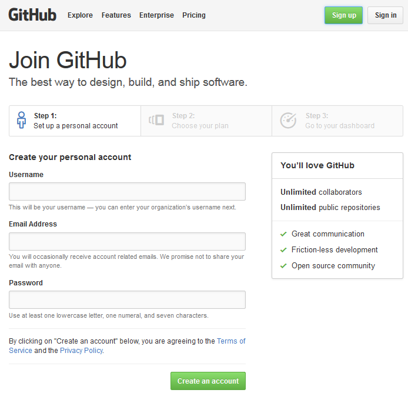

Εικόνα A.1.1: Δημιουργία λογαριασμού στο GitHub

Στο επόμενο βήμα θα σας ζητηθεί να επιλέξατε τον τύπο του λογαριασμού
σας (Εικόνα A.1.2). Μέσω χρεώσεων προσφέρονται επιπρόσθετες δυνατότητες.
Στην περίπτωση που δεν τις επιθυμείτε επιλέξτε την τελευταία επιλογή,
«Χωρίς Χρέωση» («Free»), και πατήστε το κουμπί «Ολοκλήρωση Εγγραφής»
(«Finish sign-up»).

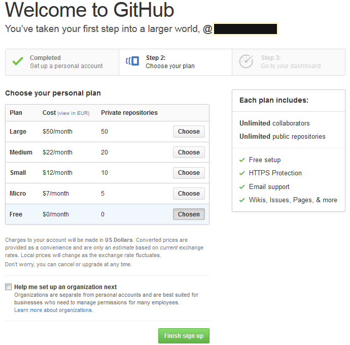

Εικόνα A.1.2: Επιλογή τύπου λογαριασμού στο GitHub

Αμέσως μετά την ολοκλήρωση της εγγραφής σας θα σας αποσταλεί ένα μήνυμα
στη διεύθυνση ηλεκτρονικού ταχυδρομείου που έχετε δηλώσει σχετικά με την
επιβεβαίωση της εγγραφής σας. Θα πρέπει να πατήσετε τον σχετικό σύνδεσμο
«Επιβεβαίωση διεύθυνσης ηλεκτρονικού ταχυδρομείου» («Verify e-mail
address») ώστε να αποσταλεί αίτημα ενεργοποίησης του λογαριασμού σας.
Άμεσα θα μεταφερθείτε στη σελίδα με το μήνυμα επιβεβαίωσης της Εικόνας
A.1.3.

Εικόνα A.1.3: Επιβεβαίωση λογαριασμού στο GitHub

Ρύθμιση του Git
-------------------------------------------------------------------------------------------------------------

Το πρώτο βήμα που πρέπει να κάνετε προτού μπορέσετε να ανεβάσετε τον
κώδικά σας στην υπηρεσία του GitHub, είναι να ρυθμίστε το Git. Το Git
είναι ένα ανοικτού κώδικα Σύστημα Ελέγχου Εκδόσεων (Version Control
System - VCS). Είναι υπεύθυνο όλα όσα σχετίζονται με το GitHub που
συμβαίνουν τοπικά στον υπολογιστή σας.

Υπάρχουν δύο τρόποι χρήσης του Git: μέσω γραμμής εντολών (διαθέσιμο από
εδώ: [http://git-scm.com](http://git-scm.com/)) και μέσω περιβάλλοντος
διεπαφής χρήστη (GUI) (διαθέσιμο από εδώ:
[https://desktop.github.com](https://desktop.github.com/)). Μερικές από
τις ενέργειες που μπορείτε να υλοποιήσετε, ακόμα και χωρίς τη χρήση
γραμμής εντολών, είναι οι εξής:

-   η δημιουργία ενός αποθετηρίου («create repository»),

-   η αντιγραφή ενός αποθετηρίου («fork repository»),

-   η ενημέρωση ενός αποθετηρίου («commit»), και

-   η αλληλεπίδραση με άλλους χρήστες.

### Εγκατάσταση του Git

Σε αυτήν την ενότητα θα περιγράψουμε τα βήματα που απατούνται για την
εγκατάσταση του περιβάλλοντος διεπαφής του Git.

1)  Κατεβάστε και εγκαταστήστε την τελευταία έκδοση του «[GitHub
    Desktop](https://desktop.github.com/)». Αυτό το πρόγραμμα θα
    εγκαταστήσει αυτόματα το Git και θα το κρατάει αυτόματα ενημερωμένο.

2)  Στον υπολογιστή σας ανοίξτε την εφαρμογή «Git Shell».

3)  Συμπληρώστε στο Git το Όνομα Χρήστη που είχατε επιλέξει κατά την
    εγγραφή σας ώστε οι ενημερώσεις σας («commits») να φέρουν την
    κατάλληλη σήμανση (Εικόνα A.1.4).

Εικόνα A.1.4: Εισαγωγή Ονόματος Χρήστη στο Git

1)  Συμπληρώστε στο Git τη διεύθυνση ηλεκτρονικού ταχυδρομείου που
    είχατε επιλέξει κατά την εγγραφή σας ώστε να συνδέονται τα «commits»
    σας με αυτήν (Εικόνα A.1.5).

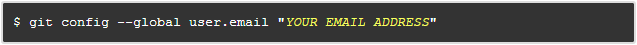

Εικόνα A.1.5: Εισαγωγή Διεύθυνσης Ηλεκτρονικού Ταχυδρομείου στο Git

### Επιβεβαίωση ταυτότητας με το GitHub από το Git

Όταν συνδέεστε σε ένα αποθετήριο GitHub από το Git, θα πρέπει να
επιβεβαιώσετε την ταυτότητά σας με το GitHub χρησιμοποιώντας έναν από
τους δύο διαθέσιμους τρόπους: είτε μέσω HTTPS είτε μέσω SSH.

*Σύνδεση μέσω HTTPS (προτείνεται)*

Αν [κλωνοποιείτε μέσω
HTTPS](https://help.github.com/articles/which-remote-url-should-i-use/#cloning-with-https-recommended)
μπορείτε να [αποθηκεύσετε στην
cache](https://help.github.com/articles/caching-your-github-password-in-git)
τον κωδικό του GitHub σας στο Git, χρησιμοποιώντας έναν βοηθό
διαπιστευτηρίων («credential helper»).

*Σύνδεση μέσω SSH*

Αν [κλωνοποιείτε μέσω
SSH](https://help.github.com/articles/which-remote-url-should-i-use/#cloning-with-ssh),
θα πρέπει να [παράξετε κλειδιά
SSH](https://help.github.com/articles/generating-ssh-keys/) σε κάθε
υπολογιστή που χρησιμοποιείτε για να μεταφέρετε από και προς το GitHub.

Με το πέρας αυτού του βήματος έχει στηθεί τόσο το Git όσο και το GitHub.
Το επόμενο βήμα είναι η δημιουργία ενός αποθετηρίου.

Δημιουργία ενός Αποθετηρίου («repo»)
----------------------------------------------------------------------------------------------------------------------------------

Σε αυτήν την ενότητα θα περιγράψουμε τη δημιουργία ενός Αποθετηρίου
(«repository») με ένα αρχείο README, στο οποίο θα τοποθετήσετε τον
κώδικά σας.

### Δημιουργήστε ένα νέο αποθετήριο στο GitHub

1)  Στην επάνω δεξιά γωνία οποιασδήποτε σελίδας, πατήστε το
    κουμπί  «**+**», και στη συνέχεια την επιλογή **«**New repository»
    («Νέο αποθετήριο») (Εικόνα A.1.6).

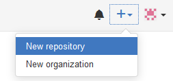

Εικόνα A.1.6: Επιλογή δημιουργίας νέου αποθετηρίου

1)  Δημιουργήστε ένα σύντομο και χαρακτηριστικό όνομα για το αποθετήριό
    σας. Για παράδειγμα «Repo\_Organization\_X**»** (Εικόνα A.1.7)**.**

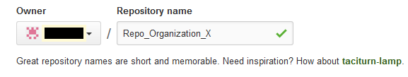

Εικόνα A.1.7: Ονομασία νέου αποθετηρίου

1)  Προαιρετικά, προσθέστε μια σύντομη περιγραφή του αποθετηρίου
    σας. Για παράδειγμα, «My first repository on GitHub» (Εικόνα A.1.8).

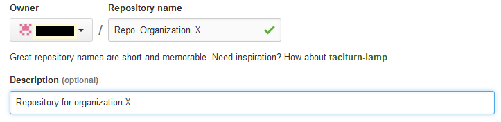

Εικόνα A.1.8: Προσθήκη περιγραφής αποθετηρίου

1)  Επιλέξτε ανάμεσα στη δημιουργία *ενός* Δημόσιου («Public») ή
    Ιδιωτικού («Private») αποθετηρίου (Εικόνα A.1.9).

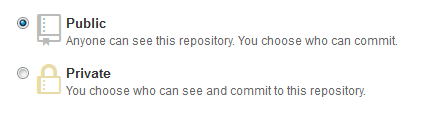

Εικόνα A.1.9: Επιλογή τύπου αποθετηρίου

1)  Επιλέξτε **«**Initialize this repository with a README»
    **(**«Αρχικοποίηση αυτού του αποθετηρίου με αρχείο README»)
    (Εικόνα A.1.10).

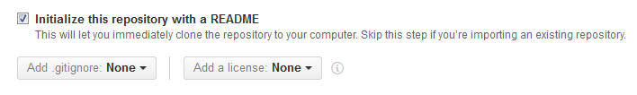

Εικόνα A.1.10: Επιλογή αρχικοποίησης αποθετηρίου με αρχείο README

1)  Πατήστε το κουμπί «Δημιουργία αποθετηρίου» («Create repository»)
    (Εικόνα A.1.11).

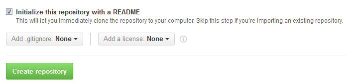

Εικόνα A.1.11: Το κουμπί  για τη δημιουργία αποθετηρίου

### Ανεβάζοντας («commit») την πρώτη αλλαγή σας

Το ανέβασμα («commit») μπορεί να θεωρηθεί ως ένα στιγμιότυπο από όλα τα
αρχεία του έργο σας σε μια συγκεκριμένη χρονική στιγμή. Όταν
δημιουργήσατε το νέο σας αποθετήριο το αρχικοποιήσατε με ένα αρχείο
README. Αυτά τα αρχεία είναι ένα εξαιρετικό μέρος για να περιγράψει το
έργο σας με περισσότερες λεπτομέρειες, ή να προσθέσετε λίγη τεκμηρίωση,
όπως το πώς να εγκατασταθεί ή να χρησιμοποιηθεί το έργο σας. Τα
περιεχόμενα αυτών των αρχείων εμφανίζονται αυτόματα στην πρώτη σελίδα
του αποθετηρίου σας. Τα βήματα που απαιτούνται για το ανέβασμα
(«commit») μιας αλλαγής στο αρχείο README είναι τα ακόλουθα:

1.  Στη λίστα αρχείων του αποθετηρίου σας, πατήστε στο «README.md»
    > (Εικόνα A.1.12).

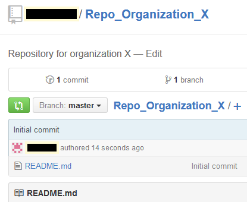

Εικόνα A.1.12: Επιλέγοντας το αρχείο README.md

1.  Πάνω από το περιεχόμενο του αρχείου, πατήστε το κουμπί επεξεργασίας
    > του αρχείου (Εικόνα A.1.13).

Εικόνα A.1.13: Το κουμπί επεξεργασίας του αρχείου

1.  Στην καρτέλα «Edit file» («Επεξεργασία αρχείου») προσθέστε κάποιες
    > πληροφορίες για τον εαυτό σας (Εικόνα A.1.14).

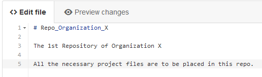

Εικόνα A.1.14: Η καρτέλα εξεργασίας του περιεχομένου

1.  Πάνω από το νέο περιεχόμενο, πατήστε την καρτέλα «Preview changes»
    > («Προεπισκόπηση αλλαγών») (Εικόνα A.1.15).

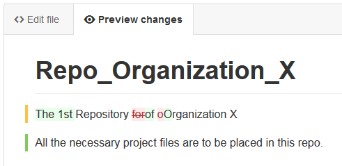

Εικόνα A.1.15: Η καρτέλα προεπισκόπησης του περιεχομένου

1.  Εξετάστε τις αλλαγές που κάνατε στο αρχείο. Θα δείτε το νέο
    > περιεχόμενο με πράσινο και τις αλλαγές με κόκκινο (Εικόνα A.1.15).

2.  Στο κάτω μέρος της σελίδας, πληκτρολογήστε ένα σύντομο μήνυμα για το
    > ανέβασμα («commit») το οποίο περιγράφει τις αλλαγές που κάνατε στο
    > αρχείο (Εικόνα A.1.16).

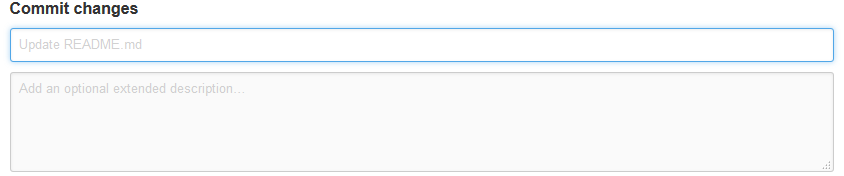

Εικόνα A.1.16: Πεδίο εισαγωγής μηνύματος για το ανέβασμα

1.  Κάτω από το προηγούμενο πεδίο μηνύματος, επιλέξτε αν οι αλλαγές θα
    > ανέβουν στον τρέχοντα «κλάδο» («branch») ή σε έναν νέο. Εάν ο
    > τρέχον είναι ο «κύριος» («master») θα πρέπει να επιλέξετε να
    > δημιουργήσετε έναν νέο για το ανέβασμα («commit») και στη συνέχεια
    > να δημιουργήσετε ένα «αίτημα έλξης» («pull request»)
    > (Εικόνα A.1.17).

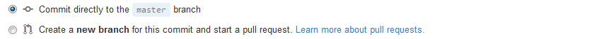

Εικόνα A.1.17: Επιλογή «κλάδου»

1.  Πατήστε το κουμπί «Propose file change» («Πρόταση αλλαγής αρχείου»)
    > (Εικόνα A.1.18).

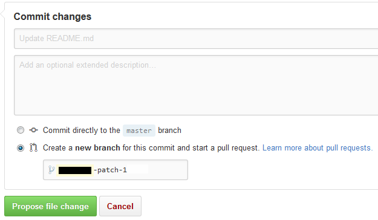

Εικόνα A.1.18: Το κουμπί υποβολής αλλαγών αρχείου

Αντιγραφή («fork») ενός Αποθετηρίου
---------------------------------------------------------------------------------------------------------------------------------

Σε αυτήν την ενότητα θα περιγράψουμε την αντιγραφή («fork») ενός
αποθετηρίου («repository») ενός τρίτου στο δικό μας. Αυτό θα σας
επιτρέψει να πειραματιστείτε ελεύθερα με αλλαγές χωρίς να επηρεαστεί το
αρχικό έργο. Συνήθως, η αντιγραφή («fork») χρησιμοποιείται για δύο
λόγους: είτε για να προτείνετε αλλαγές στο έργο κάποιου τρίτου είτε για
να χρησιμοποιήσετε το έργο ενός τρίτου ως σημείο εκκίνησης για τη δική
σας ιδέα.

*Πρόταση αλλαγών στο έργο κάποιου τρίτου*

Ένα καλό παράδειγμα χρήσης αντιγραφής («fork») είναι η πρόταση αλλαγών
για διορθώσεις σφαλμάτων. Αντί να καταγράψετε το σφάλμα που έχετε βρει,
μπορείτε:

-   Να αντιγράψετε («fork»)το αποθετήριο.

-   Να ενημερώσετε τον κώδικά του.

-   Να υποβάλετε αίτημα έλξης («pull request») στον ιδιοκτήτη του έργου.

Αν στον ιδιοκτήτη του έργου αρέσουν οι αλλαγές σας που μπορεί να
τοποθετήσουν τις προσθήκες στο αρχικό αποθετήριο.

*Χρήση έργο τρίτου ως σημείο εκκίνησης για τη δική σας ιδέα*

Ο πυρήνας του ανοικτού κώδικα είναι η ιδέα ότι μέσω του διαμοιρασμού του
μπορούμε να επιτύχουμε καλύτερη και πιο αξιόπιστο λογισμικό. Στην
πραγματικότητα, όταν δημιουργείτε ένα αποθετήριο στο GitHub, έχετε την
επιλογή αυτόματα να συμπεριλαμβάνετε ενός αρχείου άδειας χρήσης, το
οποίο καθορίζει πώς θέλετε το έργο σας να διαμοιράζεται με τους άλλους.

### Αντιγράψτε ένα αποθετήριο στο GitHub

Η αντιγραφή («fork») ενός αποθετηρίου είναι μια απλή διαδικασία δύο
σταδίων. Ένα αποθετήριο-δείγμα δημιουργημένο από το GitHub ώστε να
μπορείτε να κάνετε εξάσκηση, είναι το
[octocat/Spoon-Knife](https://github.com/octocat/Spoon-Knife).

1.  Μεταβείτε αποθετήριο του GitHub
    > [octocat/Spoon-Knife](https://github.com/octocat/Spoon-Knife).

2.  Πατήστε το κουμπί «Fork» το οποίο βρίσκεται στην επάνω δεξιά γωνία
    > της σελίδας.

### Κρατήστε το αντίγραφο συγχρονισμένο

Μπορείτε να αντιγράψατε ένα έργο προκειμένου να προτείνετε αλλαγές στο
πρωτότυπο αποθετήριο. Σε αυτήν την περίπτωση, είναι καλή πρακτική να
συγχρονίζετε τακτικά το αντίγραφό σας με το πρωτότυπο αποθετήριο. Για να
το κάνετε αυτό, θα πρέπει να χρησιμοποιήσετε το Git στη γραμμή εντολών.
Ως παράδειγμα θα χρησιμοποιήσουμε το αποθετήριο-δείγμα που αντιγράψατε
προηγουμένως. Τα βήματα είναι τα εξής:

*Βήμα 1: Ρύθμιση Git*

Αν δεν το έχετε κάνει ακόμα, θα πρέπει πρώτα να ρυθμίσετε το Git. Μην
ξεχάσετε να ρυθμίσετε την επιβεβαίωση ταυτότητας με το GitHub από το
Git.

*Βήμα 2: Δημιουργία τοπικού κλώνου της αντιγραφής*

Αυτή τη στιγμή, έχετε ένα αντίγραφο του αποθετηρίου
[octocat/Spoon-Knife](https://github.com/octocat/Spoon-Knife) αλλά δεν
έχετε τα αρχεία του στον υπολογιστή σας. Ας δημιουργήσουμε έναν κλώνο
του τοπικά στον υπολογιστή σας.

1.  Στις GitHub, πλοηγηθείτε στο αντίγραφο του
    > συγκεκριμένου αποθετηρίου.

2.  Στην δεξιά στήλη της σελίδας του αντιγραμμένου αποθετηρίου σας
    > πατήστε το εικονίδιο της Εικόνας A.1.19 για να αντιγράψετε το «URL
    > κλώνου» στο αντίγραφό σας.

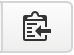

Εικόνα A.1.19: Το κουμπί επεξεργασίας του αρχείου

1.  Ανοίξτε το τη γραμμή εντολών ή την κονσόλα τερματικού.

2.  Πληκτρολογήστε «*git clone*» και στη συνέχεια επικολλήστε τη
    > διεύθυνση URL που αντιγράψατε στο 2.

3.  Πατήστε το πλήκτρο Enter. Θα δημιουργηθεί ο τοπικός κλώνος σας.

*Βήμα 3: Ρύθμιση Git να συγχρονίζει το αντίγραφο με το αρχικό
αποθετήριο*

Όταν αντιγράφετε ένα έργο με στόχο να προτείνει αλλαγές στο αρχικό
αποθετήριο, μπορείτε να ρυθμίσετε το Git για να τραβήξει αλλαγές από το
αρχικό στον τοπικό κλώνο σας.

1.  Επαναλάβετε τα 1 έως 3 από το Βήμα 2.

2.  Αλλάξτε τους καταλόγους στη θέση του αντιγράφου που κλωνοποιήσατε
    > κατά το Βήμα 2:

-   Μεταβείτε στον αρχικό κατάλογο και πληκτρολογήστε απλά «*cd*» χωρίς
    > άλλο κείμενο.

<!-- -->

-   Για να δείτε τα αρχεία και τους φακέλους στον τρέχοντα κατάλογο
    > πληκτρολογήστε «*ls*»

-   Για να μεταβείτε σε ένα από τους καταλόγους που παρατίθενται
    > πληκτρολογήστε «*cd *your\_listed\_directory**»

-   Για να ανεβείτε ένα κατάλογο, πληκτρολογήστε «*cd ../*»

1.  Πληκτρολογήστε «*git remote –v*» και πατήστε «Enter». Θα δείτε το
    > τρέχον διαμορφωμένο απομακρυσμένο αποθετήριο για αντιγραφή.

2.  Πληκτρολογήστε «*git remote add upstream*» και στη συνέχεια
    > επικολλήστε τη διεύθυνση URL που αντιγράψατε στο 2 του Βήματος 2
    > και πατήστε «Enter».

3.  Για να επαληθεύσετε το πρωτότυπο αποθετήριο που έχετε ορίσει για το
    > αντίγραφό σας, πληκτρολογήστε ξανά «*git remote –v*». Θα πρέπει να
    > δείτε τη διεύθυνση URL για το αντίγραφό σας ως «origin» και τη
    > διεύθυνση URL για το πρωτότυπο αποθετήριο ως «upstream».

Δημιουργώντας ένα αίτημα έλξης («pull request»)
---------------------------------------------------------------------------------------------------------------------------------------------

Δημιουργήστε ένα αίτημα έλξης («pull request») για να προτείνετε και να
συνεργαστείτε πάνω σε αλλαγές σε ένα αποθετήριο. Αυτές οι αλλαγές
προτείνονται σε έναν κλάδο, ώστε να εξασφαλιστεί ότι ο «master» κλάδος
διατηρείται καθαρό και τακτοποιημένος.

Αίτημα έλξης («pull request») ανοίγονται μόνο αν υπάρχουν διαφορές
μεταξύ των δευτερευόντων κλάδων και του βασικού. Μπορείτε να καθορίσετε
σε ποιον κλάδο θα θέλατε να ενσωματώσετε τις αλλαγές σας, όταν
δημιουργείτε το αίτημα.

1.  Στο GitHub, πλοηγηθείτε στο αποθετήριο στον οποίο θέλετε να
    προτείνετε αλλαγές.

2.  Στο μενού «Branch» («Κλάδοι») επιλέξτε τον κλάδο που περιέχει τις
    αλλαγές σας (Εικόνα A.1.20).

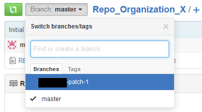

Εικόνα A.1.20: Ο κλάδος με τις αλλαγές

1.  Στα αριστερά του μενού «Branch» πατήστε το πράσινο κουμπί «Compare
    and Review» («Σύγκριση και Αξιολόγηση») (Εικόνα A.1.21).

Εικόνα A.1.21: Σύγκριση κλάδου με τον πρωτότυπο

1.  Η σελίδα «Compare» («Σύγκριση») θα επιλέξει αυτόματα τον βασικό και
    τον συγκρινόμενο κλάδο. Πατήστε την επιλογή «Create pull request»
    («Δημιουργία αιτήματος έλξης») (Εικόνα A.1.22).

Εικόνα A.1.22: Το κουμπί δημιουργίας νέου αιτήματος

1.  Πληκτρολογήστε έναν τίτλο και μια περιγραφή για το αίτημά σας
    (Εικόνα A.1.23).

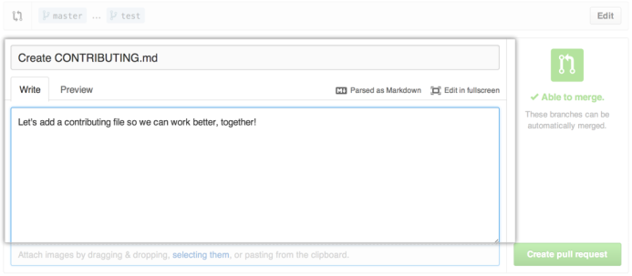

Εικόνα A.1.23: Εισαγωγή τίτλου και περιγραφής αιτήματος

1.  Πατήστε την επιλογή «Create pull request» («Δημιουργία
    αιτήματος έλξης») (Εικόνα A.1.24).

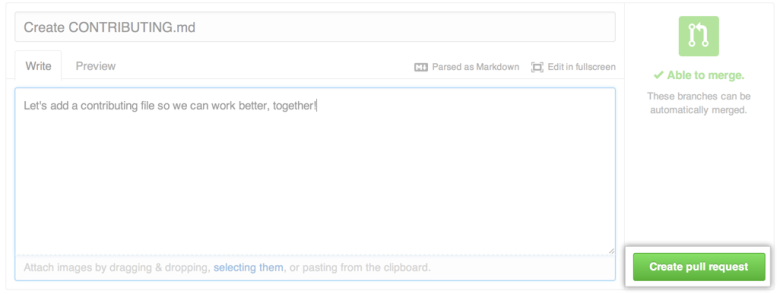

Εικόνα A.1.24: Το κουμπί δημιουργίας του αιτήματος

Έπειτα από την αναθεώρηση του αιτήματος έλξης σας («pull request») αυτό
μπορεί να συγχωνευθεί στο αποθετήριο.

Συγχώνευση αιτήματος έλξης («pull request»)
-----------------------------------------------------------------------------------------------------------------------------------------

Έπειτα από την αναθεώρηση ενός αιτήματος έλξης («pull request») αυτό
μπορεί να συγχωνευθεί στο πρωτότυπο κλάδο. Καθένας με δικαιώματα ώθησης
(«push») στο αποθετήριο μπορεί να ολοκληρώσει τη συγχώνευση.

Εάν αποφασίσετε ότι δεν θέλετε οι αλλαγές στον κλάδο σας να συγχωνευθούν
με τον πρωτότυπο κλάδο, μπορείτε επίσης να κλείσετε το αίτημα έλξης
(«pull request») χωρίς να γίνει συγχώνευση.

### Συγχώνευση αιτήματος έλξης («pull request») με χρήση του περιηγητή

Εάν η συγχώνευση δεν θα έχει συγκρούσεις τότε μπορείτε να συγχωνεύσετε
το αίτημα από τον περιηγητή.

1.  Στην δεξιά στήλη οποιουδήποτε αποθετηρίου, πατήστε το κουμπί «Pull
    Requests» («Αιτήσεις Ώθησης») (Εικόνα A.1.25).

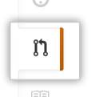

Εικόνα A.1.25: Το κουμπί αιτήσεων ώθησης

1.  Σε αυτή τη λίστα, πατήστε στο αίτημα έλξης («pull request») που
    θέλετε να συγχωνεύσετε.

2.  Πατήστε το κουμπί «Merge pull request» («Συγχώνευση
    αιτήματος έλξης») (Εικόνα A.1.26).

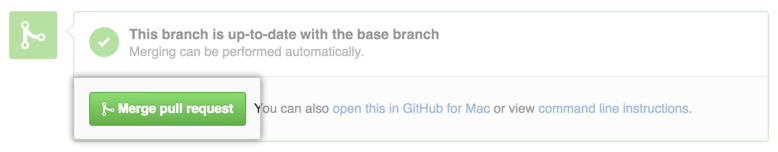

Εικόνα A.1.26: Το κουμπί συγχώνευσης αιτήματος

1.  Πληκτρολογήστε ένα μήνυμα, ή αποδεχτείτε το προεπιλεγμένο
    (Εικόνα A.1.27).

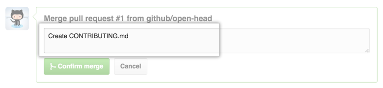

Εικόνα A.1.27: Το πεδίο πληκτρολόγησης μηνύματος συγχώνευσης

1.  Κάτω από το παράθυρο του μηνύματος πατήστε το κουμπί «Confirm merge»
    («Επιβεβαίωση συγχώνευσης») (Εικόνα A.1.28).

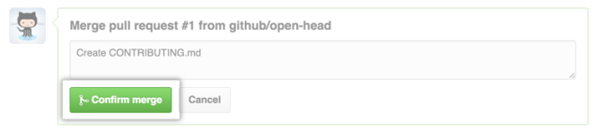

Εικόνα A.1.28: Το κουμπί επιβεβαίωσης συγχώνευσης

1.  Προαιρετικά, διαγράψτε τον κλάδο. Αυτό κρατά τη λίστα των κλάδων στο
    αποθετήριό σας τακτοποιημένο.

Από τη γραμμή εντολών οι αιτήματα έλξης («pull requests») συγχωνεύονται
χρησιμοποιώντας την επιλογή «*--no-ff*».

Αλληλεπίδραση με τρίτους
----------------------------------------------------------------------------------------------------------------------

Ένα από τα μεγάλα χαρακτηριστικά γνωρίσματα του GitHub είναι η
δυνατότητα να δείτε πάνω σε τι εργάζονται άλλοι άνθρωποι καθώς και με
ποιους συνδέονται. Μερικές από τις ενέργειες αλληλεπίδρασης με τρίτους
είναι οι παρακάτω:

-   Ακολουθήστε ανθρώπους: Όταν ακολουθείτε κάποιον στο GitHub θα
    λαμβάνετε ειδοποιήσεις σχετικά με τη δραστηριότητά τους. Για να
    ακολουθήσετε κάποιον μπείτε σε μια από τις σελίδες του και πατήστε
    το κουμπί «follow» («ακολουθώ»).

-   Παρακολουθήστε ένα έργο: Σε κάποιο σημείο μπορεί να θέλετε να
    μείνετε ενημερωμένοι με ένα συγκεκριμένο έργο. Όταν είστε σε μια από
    τις σελίδες του έργου, μπορείτε να πατήστε το κουμπί
    «Watch» («παρακολούθηση») το οποίο βρίσκεται στην κορυφή
    της σελίδας. Όταν ο ιδιοκτήτης ενημερώνει το αποθετήριο
    θα ενημερώνεστε.

-   Σήμανση έργων: Σε περίπτωση που βρίσκετε ένα έργο ενδιαφέρον
    μπορείτε να το επισημάνετε πατώντας το κουμπί με το Αστέρι το οποίο
    βρίσκεται στην κορυφή της σελίδας, όταν είστε σε μια από τις σελίδες
    του έργου. Μπορείτε να επισκεφτείτε τη σελίδα με τα αστέρια σας ώστε
    να δείτε όλα τα έργα που έχετε επισημάνει.

ΠΑΡΑΡΤΗΜΑ Α.2: Ενδεικτικός κατάλογος αδειών στο GitHub
====================================================================================================================================================

Περιγραφή: Εδώ παρατίθενται κάποια ενδεικτικά είδη αδειών που μπορούν να
χρησιμοποιηθούν στο GitHub.

Ευρέως διαδεδομένες άδειες που υποστηρίζονται από πολλές κοινότητες:

-   Apache License, 2.0 (Apache-2.0)

<!-- -->

-   BSD 3-Clause "New" or "Revised" license (BSD-3-Clause)

-   BSD 2-Clause "Simplified" or "FreeBSD" license (BSD-2-Clause)

-   GNU General Public License (GPL)

-   GNU Library or "Lesser" General Public License (LGPL)

-   MIT license (MIT)

-   Mozilla Public License 2.0 (MPL-2.0)

-   Common Development and Distribution License (CDDL-1.0)

-   Eclipse Public License (EPL-1.0)

Άδειες ειδικού σκοπού:

-   Educational Community License, Version 2.0 (ECL-2.0)

-   IPA Font License (IPA)

-   NASA Open Source Agreement 1.3 (NASA-1.3)

-   Open Font License 1.1 (OFL-1.1)

Λοιπές / Διάφορες άδειες:

-   Apache Software License 1.1 (Apache-1.1)

-   Common Public License 1.0 (CPL-1.0)

-   Artistic license 1.0 (Artistic-1.0)

-   Educational Community License, Version 1.0 (ECL-1.0)

-   Eiffel Forum License V1.0 (EFL-1.0)

-   Lucent Public License ("Plan9"), version 1.0 (LPL-1.0)

-   Mozilla Public License 1.0 (MPL-1.0)

-   Mozilla Public License 1.1 (MPL-1.1)

-   Open Software License 1.0 (OSL-1.0)

-   Open Software License 2.1 (OSL-2.1)

-   Reciprocal Public License, version 1.1 (RPL-1.1)

-   Adaptive Public License (APL-1.0)

-   Artistic license 2.0 (Artistic-2.0)

-   Open Software License (OSL-3.0)

-   Q Public License (QPL-1.0)

-   Universal Permissive License (UPL)

-   zlib/libpng license (Zlib)

Μη ταξινομημένες άδειες:

-   Boost Software License (BSL-1.0)

-   CeCILL License 2.1 (CECILL-2.1)

-   Common Public Attribution License 1.0 (CPAL-1.0)

-   European Union Public License (EUPL-1.1)

-   GNU Affero General Public License v3 (AGPL-3.0)

-   ISC License (ISC)

-   Microsoft Public License (MS-PL)

-   Microsoft Reciprocal License (MS-RL)

-   MirOS Licence (MirOS)

-   Non-Profit Open Software License 3.0 (NPOSL-3.0)

-   NTP License (NTP)

-   Reciprocal Public License 1.5 (RPL-1.5)

-   Simple Public License 2.0 (SimPL-2.0)

-   Open Group Test Suite License (OGTSL)

ΠΑΡΑΡΤΗΜΑ Β.1: Οδηγός Χρήσης Wikimedia Commons
============================================================================================================================================

Σε αυτό το παράρτημα
περιγράφεται πως κάποιος χρήστης ενός δημοσίου φορέα μπορεί να εγγραφεί
στην υπηρεσία του Wikimedia Commons και να μεταφορτώσει πολυμεσικό
περιεχόμενο ή να επεξεργαστεί πληροφορίες σχετικά με αυτό.

Εγγραφή χρήστη στην ιστοσελίδα της υπηρεσίας
--------------------------------------------

Για να μπορέσετε να χρησιμοποιήσετε την υπηρεσία του Wikimedia Commons
ώστε να μπορέσετε να ανεβάσετε πολυμεσικό περιεχόμενο θα πρέπει να
δημιουργήστε έναν λογαριασμό αποκτώντας όνομα χρήστη και κωδικό
πρόσβασης. Ανοίξτε τη σελίδα
<https://commons.wikimedia.org/wiki/Main_Page> και πατήστε τον σύνδεσμο
«Create account» («Δημιουργία λογαριασμού») ώστε να μεταφερθείτε στη
σελίδα εγγραφής χρήστη. Τα ζητούμενα πεδία προς συμπλήρωση όπως
φαίνονται και στην Εικόνα B.1.1 είναι τα εξής:

-   «Username» («Όνομα Χρήστη»),

-   «E-mail Address» ( «Διεύθυνση ηλεκτρονικού ταχυδρομείου»),

-   «Password» («Κωδικός»), και

-   «Confirm Password» («Επιβεβαίωση Κωδικού»).

Συμπληρώστε το πεδίο CAPTCHA και έπειτα πατήστε το κουμπί «Create your
account» («Δημιουργήστε το λογαριασμό σας»).

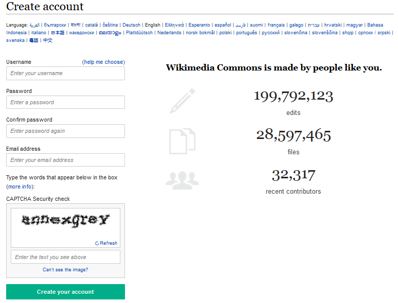

Εικόνα B.1.1: Δημιουργία λογαριασμού στο data.gov.gr

Αμέσως μετά την ολοκλήρωση της εγγραφής σας θα σας αποσταλεί ένα μήνυμα
στη διεύθυνση ηλεκτρονικού ταχυδρομείου που έχετε δηλώσει σχετικά με την
επιβεβαίωση της εγγραφής σας. Θα πρέπει να πατήσετε τον σχετικό σύνδεσμο
ώστε να αποσταλεί αίτημα ενεργοποίησης του λογαριασμού σας

Μεταφόρτωση αρχείων πολυμεσικού περιεχομένου
------------------------------------------------------------------------------------------------------------------------------------------

Για να μπορέσετε να μεταφορτώσετε αρχεία πολυμεσικού περιεχομένου θα
πρέπει πρώτα να είστε συνδεδεμένοι στο λογαριασμό σας. Έπειτα μπορείτε
να επιλέξετε το σύνδεσμο «Upload file» («Ανέβασμα αρχείου») ο οποίος
βρίσκεται στην αριστερή στήλη των σελίδων. Ένας οδηγός θα σας
καθοδηγήσει.

1.  Στο πρώτο βήμα σας προτρέπει η υπηρεσία να διαβάστε τις πληροφορίες
    που παρέχονται για να σιγουρευτείτε πως αρχεία σας συμμορφώνονται με
    τις κατευθυντήριες γραμμές της Wikimedia Commons. Πηγαίνετε στο κάτω
    μέρος της οθόνης και πατήστε το κουμπί «Next» («Επόμενο»).

2.  Στη νέα σελίδα πατήστε το κουμπί «Select media files to share»
    («Επιλογή πολυμεσικών αρχείων για διαμοιρασμό»). Στη συνέχεια θα σας
    ζητηθεί να επιλέξετε το αρχείο σας. Μπορείτε να επιλέξετε να
    προσθέσετε και άλλα αρχεία ταυτόχρονα πατώντας το κουμπί «Add more
    files» («Προσθήκη επιπρόσθετων αρχείων») ή να συνεχίσετε στο επόμενο
    βήμα πατώντας το κουμπί «Continue» («Συνέχεια»).

3.  Το επόμενο βήμα είναι να καθορίσετε ποια τις άδειες των αρχείων σας.

    -   Αν έχετε δημιουργήσει την εικόνα μόνοι σας, τότε επιλέξτε το
        > «This file is my own work» («Το αρχείο προέρχεται από δική
        > μου εργασία») και εν συνεχεία μπορείτε να επιλέξετε από μια
        > λίστα των επιτρεπόμενων αδειών (Εικόνα B.1.2).

    -   Αν δεν έχετε δημιουργήσει την εικόνα σας, στη συνέχεια, επιλέξτε
        > «This file is not my own work» («Το αρχείο δεν προέρχεται από
        > δική μου εργασία») και συμπληρώστε τα απαιτούμενα πεδία
        > (Εικόνα B.1.3).

> Μετά την επιλογή των κατάλληλων αδειών πατήστε το κουμπί «Next»
> («Επόμενο»).

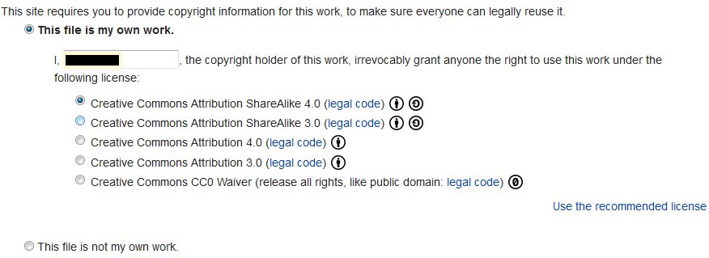

Εικόνα B.1.2: Οι επιλογές αδειών δικού μας αρχείο

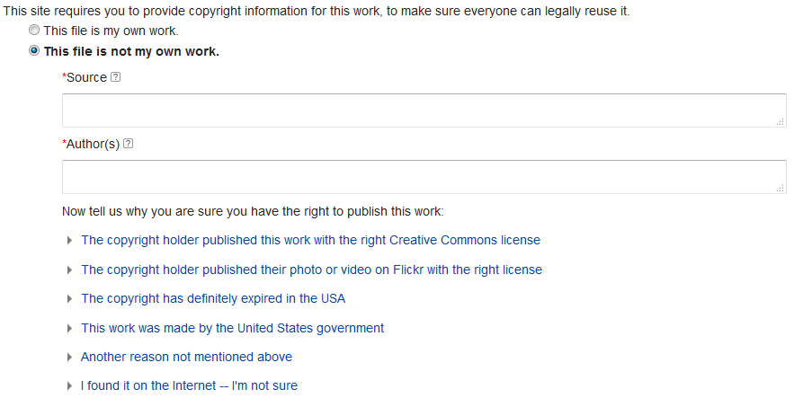

Εικόνα B.1.3: Οι επιλογές αδειών αρχείο από τρίτη πηγή

1.  Το επόμενο βήμα (Εικόνα B.1.4) είναι η προσθήκη περιγραφής στα
    διαμοιρασμένα αρχεία σας. Δημιουργήστε έναν τίτλο και μια σύντομη
    περιγραφή για το τι περιέχεται σε κάθε αρχείο σας. Μπορείτε ακόμα να
    προσθέσετε την περιγραφή σας σε άλλες γλώσσες. Επίσης, μην ξεχάσετε
    να προσθέσετε κατηγορίες, καθώς αυτό θα κάνει τα αρχεία σας πιο
    εύκολα αναζητήσιμα. Όταν τελειώσετε πατήστε το κουμπί
    «Next» («Επόμενο») και τα αρχεία σας θα δημοσιευτούν στην υπηρεσία
    του Wikimedia Commons.

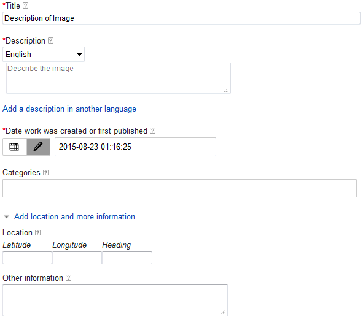

Εικόνα B.1.4: Τα πεδία περιγραφής του αρχείου

Επεξεργασία αρχείων πολυμεσικού περιεχομένου
------------------------------------------------------------------------------------------------------------------------------------------

Μπορείτε να βρείτε τους συνδέσμους προς τα αρχεία που έχετε ανεβάσει
πατώντας το σύνδεσμο «Uploads» («Μεταφορτώσεις»). Επιλέξτε τον σύνδεσμο
του αρχείου το οποίο επιθυμείτε να επεξεργαστείτε και στη νέα σελίδα
πατήστε το «Edit» («Επεξεργασία»), το οποίο μπορείτε να το δείτε στην
Εικόνα B.1.5. Κάνοντας χρήση [Mark
Up](https://en.wikipedia.org/wiki/Help:Wiki_markup) κείμενου, προσθέστε
τις αλλαγές που θέλετε να κάνετε. Όταν τελειώσετε, βεβαιωθείτε ότι έχετε
γράψει μια φράση στο πεδίο «Edit summary» («Περίληψης Επεξεργασίας»)
σχετικά με τις αλλαγές που έγιναν και πατήστε το κουμπί «Save Page»
(«Αποθήκευση σελίδας») όταν τελειώσετε.

Με όμοιο τρόπο μπορείτε να επεξεργαστείτε σελίδες οι οποίες περιγράφουν
πολυμεσικό περιεχόμενο και δεν έχουν δημιουργηθεί από εσάς.

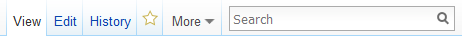

Εικόνα B.1.5: Οι επιλογές στις σελίδες

ΠΑΡΑΡΤΗΜΑ Β.2: Οδηγός Χρήσης Flickr
=================================================================================================================================

Σε αυτό το παράρτημα
περιγράφεται πως κάποιος χρήστης ενός δημοσίου φορέα μπορεί να εγγραφεί
στην υπηρεσία του Flickr, να μεταφορτώσει περιεχόμενο, να επεξεργαστεί
και να οργανώσει πολυμεσικό περιεχόμενο.

Εγγραφή χρήστη στην ιστοσελίδα της υπηρεσίας
--------------------------------------------

Για να μπορέσετε να χρησιμοποιήσετε την υπηρεσία του Flickr ώστε να
μπορέσετε να ανεβάσετε πολυμεσικό περιεχόμενο θα πρέπει να δημιουργήστε
έναν λογαριασμό αποκτώντας όνομα χρήστη και κωδικό πρόσβασης. Ανοίξτε τη
σελίδα [https://www.flickr.com](https://www.flickr.com/) και πατήστε τον
σύνδεσμο «Sign Up» («Εγγραφή») ώστε να μεταφερθείτε στη σελίδα εγγραφής
χρήστη. Το Flickr ανήκει στην εταιρία Yahoo! συνεπώς απαιτείται η
δημιουργία αντίστοιχου λογαριασμού. Τα ζητούμενα πεδία προς συμπλήρωση
όπως φαίνονται και στην Εικόνα B.2.1 είναι τα εξής:

-   «Όνομα»,

-   «Επώνυμο»,

-   «Όνομα χρήστη Yahoo»,

-   «Κωδικός πρόσβασης»,

-   «Αριθμός κινητού»,

-   «Ημερομηνία γέννησης», και

-   «Φύλο».

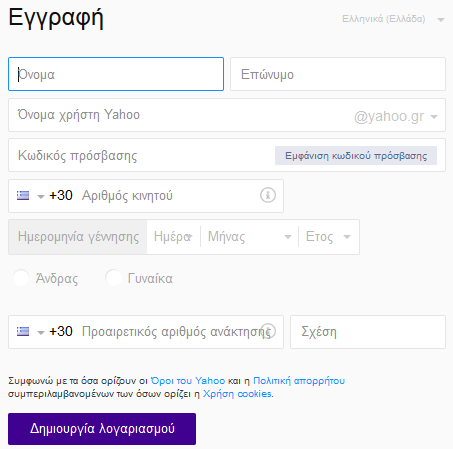

Εικόνα B.2.1: Δημιουργία λογαριασμού στο Flickr

Πατήστε το κουμπί «Δημιουργία λογαριασμού» και ακολουθήστε τις οδηγίες
στις επόμενες σελίδες που θα εμφανιστούν. Μετά την ολοκλήρωση της
διαδικασίας θα σας ζητηθεί να εισέλθετε στην υπηρεσία και στη συνέχεια
να καθορίσει το όνομά σας όπως θα εμφανίζεται στο Flickr. Αυτό μπορείτε
να τα αλλάξετε οποιαδήποτε στιγμή (Εικόνα B.2.2) και μπορεί να είναι
διαφορετικό από το όνομα του Yahoo! λογαριασμού σας.

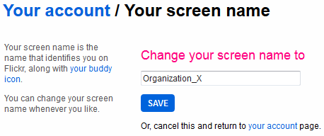

Εικόνα B.2.2: Μετονομάζοντας το όνομα χρήστη στο Flickr

Μεταφόρτωση και επεξεργασία αρχείων πολυμεσικού περιεχομένου
----------------------------------------------------------------------------------------------------------------------------------------------------------

Για να μπορέσετε να μεταφορτώσετε αρχεία πολυμεσικού περιεχομένου θα
πρέπει πρώτα να είστε συνδεδεμένοι στο λογαριασμό σας. Έπειτα μπορείτε
να πατήστε το κουμπί με το σύννεφο (Εικόνα B.2.3) το οποίο βρίσκεται στο
επάνω και δεξί μέρος της σελίδας (ή μέσω αυτού του συνδέσμου
<https://www.flickr.com/photos/upload>) ώστε να μεταφερθείτε στην
κατάλληλη σελίδα. Ένας οδηγός θα σας καθοδηγήσει. Θα σας δοθούν τρεις
επιλογές μεταφόρτωσης (Εικόνα B.2.4):

1.  Να σύρετε και να αφήστε τα αρχεία σας περιεχομένου στην εμφανιζόμενη
    σελίδα,

2.  Να πατήστε το κουμπί «Add» («Προσθήκη») ή το «Choose photos and
    videos» («Επιλογή εικόνων και βίντεο») και να επιλέξετε τα αρχεία
    σας, ή

3.  Να κατεβάσετε και να εγκαταστήστε ένα πρόγραμμα στον υπολογιστή σας
    για να μεταφορτώνετε τα αρχεία σας μέσω αυτού.

Εικόνα B.2.3: Το κουμπί μεταφόρτωσης

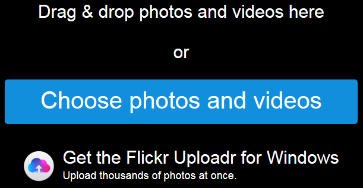

Εικόνα B.2.4: Οι τρεις επιλογές μεταφόρτωσης

Σε αυτό το εγχειρίδιο θα περιγράψουμε τη μέθοδο νούμερο 2. Τα βήματα που
πρέπει να ακολουθηθούν είναι τα εξής:

1.  Πατήστε το κουμπί «Add» («Προσθήκη») ή το «Choose photos and videos»
    («Επιλογή εικόνων και βίντεο») και ένα παράθυρο θα εμφανιστεί μέσω
    του οποίου μπορείτε να επιλέξετε τα αρχεία σας.

2.  Επιλέξτε ένα ή περισσότερα αρχεία για μεταφόρτωση από τον υπολογιστή
    σας και πατήστε «Άνοιγμα» ή «Open».

3.  Μία νέα σελίδα εμφανίζεται μέσω της οποίας μπορείτε να ορίσετε
    τίτλο, περιγραφή, επιλογές απορρήτου, ετικέτες, γεωγραφική σήμανση
    και ομάδες για κάθε ένα από τα αρχεία σας. Επίσης μπορείτε να
    επεξεργαστείτε, να διαγράψετε και να αλλάξετε τη σειρά εμφάνισης των
    αρχείων (Εικόνα B.2.5).

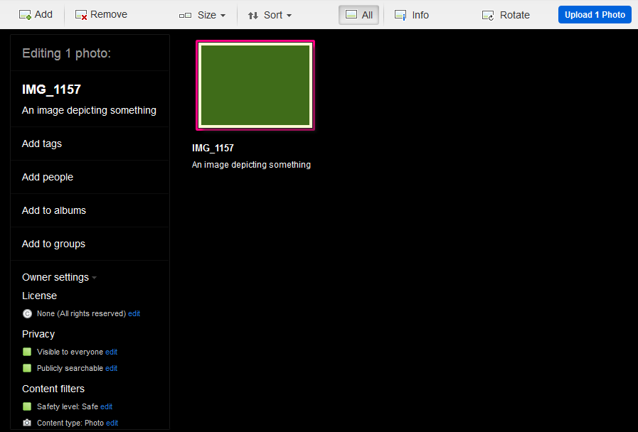

Εικόνα B.2.5: Μεταφόρτωση αρχείων

1.  Πατήστε το κουμπί «Upload» («Μεταφόρτωση») στην πάνω δεξιά γωνία.

2.  Τα αρχεία σας θα εμφανιστούν άμεσα στη σελίδα «Photostream»
    («Ροή Φωτογραφιών»). Εάν δεν αναφέρεται ημερομηνία στα αρχεία, το
    Flickr δίνει αυτόματα την ημερομηνία που μεταφορτώθηκαν ως την
    ημερομηνία λήψης τους.

3.  Επιλέγοντας οποιαδήποτε από τα αρχεία σας μπορείτε να δείτε και να
    επεξεργαστείτε τα χαρακτηριστικά τους (Εικόνα B.2.6). Έχετε τη
    δυνατότητα να προσθέσετε περισσότερες ετικέτες, να αλλάξετε τις
    ρυθμίσεις των πνευματικών δικαιωμάτων για την εικόνα, την ημερομηνία
    λήψης, τη σήμανσή τους και να τα αποκρύψετε από δημόσια αναζήτηση.

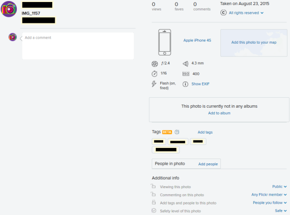

Εικόνα B.2.6: Επεξεργασία χαρακτηριστικών αρχείου

Δημιουργία Άλμπουμ
----------------------------------------------------------------------------------------------------------------

Τα Άλμπουμ είναι ο τρόπος που το Flickr επιτρέπει τη διαλογή και
ταξινόμηση των αρχείων σας. Αυτό είναι πρακτικό σε περίπτωση που έχετε
μεγάλο πλήθος αρχείων στη ροή σας και θέλετε να τα χωρίστε, π.χ. ανά
θεματικές ενότητες.

Ενώ είστε στη σελίδα «Camera Roll»
([https://www.flickr.com/cameraroll](https://www.flickr.com/cameraroll/))
επιλέξτε τα αρχεία που επιθυμείτε να εισάγετε σε ένα νέο Άλμπουμ και
επιλέξτε την επιλογή «Create new album» («Δημιουργία νέου άλμπουμ»),
όπως φαίνεται στην Εικόνα B.2.7. Ακολουθήστε τις οδηγίες και αφού
εισαγάγετε ένα όνομα και μία περιγραφή το Άλμπουμ θα δημιουργηθεί. Τώρα
θα εμφανίζεται στην αντίστοιχη σελίδα του όπου θα περιέχει τα επιλεγμένα
αρχεία. Ομοίως προστίθενται νέα αρχεία.

Αν θελήσετε να διαγράψετε κάποιο άλμπουμ τα αρχεία που περιέχονται σε
αυτό παραμένουν.

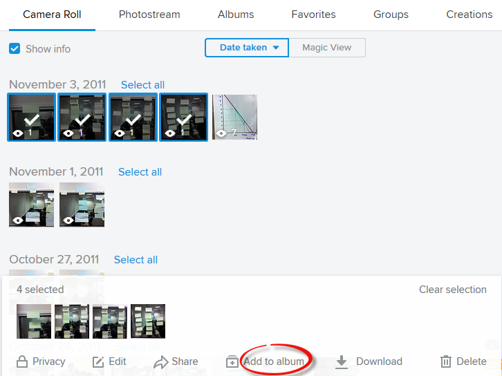

Εικόνα B.2.7: Η δημιουργία νέου άλμπουμ

Αλληλεπίδραση με τρίτους
----------------------------------------------------------------------------------------------------------------------

Ένα από τα μεγάλα χαρακτηριστικά γνωρίσματα του Flickr είναι η
δυνατότητα να δείτε το υλικό που διαμοιράζουν άλλοι άνθρωποι, τα
ενδιαφέροντά τους καθώς και με ποιους συνδέονται. Μερικές από τις
ενέργειες αλληλεπίδρασης με τρίτους είναι οι παρακάτω:

-   Ακολουθήστε λογαριασμούς: Όταν ακολουθείτε κάποιον στο Flickr θα
    λαμβάνετε ειδοποιήσεις σχετικά με τη δραστηριότητά τους. Για να
    ακολουθήσετε κάποιον μπείτε σε μια από τις σελίδες του και πατήστε
    το κουμπί «Follow» («ακολουθώ»). Μπορείτε να δείτε τα άτομα που
    ακολουθείτε από αυτόν τον σύνδεσμο:
    <https://www.flickr.com/photos/friends> .

-   Σήμανση αρχείων: Σε περίπτωση που βρίσκετε ένα αρχείο ενδιαφέρον
    μπορείτε να το επισημάνετε ως αγαπημένο πατώντας το κουμπί με το
    Αστέρι το οποίο βρίσκεται στην κάτω μέρος ενός αρχείου.

-   Σχολιασμός αρχείων: Σε περίπτωση που επιθυμείτε να μοιραστείτε τη
    γνώμη σας για ένα αρχείο μπορείτε να το κάνετε γράφοντας στο
    κατάλληλο πεδίο το οποίο βρίσκεται από κάτω από ένα
    επιλεγμένο αρχείο.

-   «Groups» («Ομάδες»): πρόκειται για ομάδες λογαριασμών οι οποίες
    μοιράζονται αρχεία παρόμοιου περιεχομένου. Για να γίνετε μέλος μίας
    ομάδας πατήστε το κουμπί «Join Group» («Εγγραφείτε στην Ομάδα»).
    Μπορείτε να δείτε τις ομάδες στις οποίες ανήκετε από αυτόν τον
    σύνδεσμο: <https://www.flickr.com/groups> .

ΠΑΡΑΡΤΗΜΑ Γ: Οδηγός Χρήσης data.dov.gr
====================================================================================================================================

Σε αυτό το παράρτημα
περιγράφεται πως κάποιος χρήστης ενός δημοσίου φορέα μπορεί να εγγραφεί
στην υπηρεσία του data.dov.gr και να καταχωρήσει νέο σύνολο δεδομένων.

Εγγραφή χρήστη στην ιστοσελίδα της υπηρεσίας
--------------------------------------------

Για να μπορέσετε να χρησιμοποιήσετε την υπηρεσία του data.gov.gr ώστε να
μπορέσετε να ανεβάσετε σύνολα δεδομένων (datasets) θα πρέπει να
δημιουργήστε έναν λογαριασμό αποκτώντας όνομα χρήστη και κωδικό
πρόσβασης. Ανοίξτε τον σύνδεσμο <http://data.gov.gr/user/register> ώστε
να μεταφερθείτε στη σελίδα εγγραφής χρήστη. Τα ζητούμενα πεδία προς
συμπλήρωση όπως φαίνονται και στην Εικόνα Γ.1 είναι τα εξής:

-   «Όνομα Χρήστη»,

-   «Πλήρες Όνομα»,

-   «E-mail»,

-   «Κωδικός», και

-   «Επιβεβαίωση».

Έπειτα πατήστε το κουμπί «Δημιουργήστε έναν λογαριασμό» ώστε να
ολοκληρώσετε τη διαδικασία. Άμεσα θα μεταφερθείτε στην προσωπική σας
σελίδα χρήστη του συστήματος, όπως εμφανίζεται στην Εικόνα Γ.2.

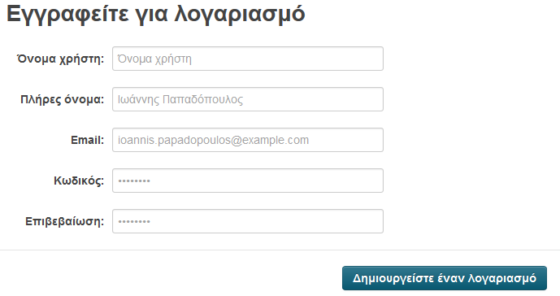

Εικόνα Γ.1: Δημιουργία λογαριασμού στο data.gov.gr

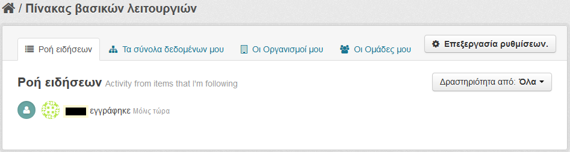

Εικόνα Γ.2: Η σελίδα χρήστη του συστήματος

Καταχώρηση Νέου Συνόλου Δεδομένων
-------------------------------------------------------------------------------------------------------------------------------

Σε αυτό το σημείο πρέπει να σημειωθεί πως μόνο οι πιστοποιημένοι χρήστες
οι οποίοι ανήκουν σε Φορείς του δημοσίου έχουν δικαιώματα καταχώρησης
νέων συνόλων δεδομένων. Στο έγγραφο «[Οδηγός Διαχειριστή Φορέα για το
data.gov.gr](http://data.gov.gr/files/UserGuide_data.gov.gr.ver.1.0.pdf)»
περιγράφονται αναλυτικά τα απαιτούμενα βήματα.

ΠΑΡΑΡΤΗΜΑ Δ.1: Οδηγός Χρήσης Αποθετηρίου Κατάθεσης Μελετών Δημοσίου
=================================================================================================================================================================

Σε αυτό το παράρτημα
περιγράφεται πως κάποιος χρήστης ενός δημοσίου φορέα μπορεί να εγγραφεί
στην υπηρεσία του Αποθετηρίου Κατάθεσης Μελετών Δημοσίου και να
μεταφορτώσει μελέτες.

Εγγραφή χρήστη στην ιστοσελίδα της υπηρεσίας
--------------------------------------------

Η υπηρεσία παρέχει ένα έγγραφο το οποίο περιγράφει αναλυτικά τα βήματα
που απαιτούνται για την εγγραφή ενός χρήστη. Οι οδηγίες είναι διαθέσιμες
σε αυτόν τον σύνδεσμο:
<http://resources.ekdd.gr/knowledge/files/odigies_public_v2.pdf>

Ανάρτηση Νέας Μελέτης Δημοσίου
----------------------------------------------------------------------------------------------------------------------------

Για να μπορέσετε να αναρτήσετε μία νέα μελέτη δημοσίου θα πρέπει να
πατήσετε τον σύνδεσμο «Ανάρτηση Μελετών Δημοσίου» ο οποίος βρίσκεται
στην αριστερή στήλη επιλογών, ή ακολουθώντας αυτόν τον σύνδεσμο:
[resources.ekdd.gr/knowledge/index.php?
option=com\_php&Itemid=2](resources.ekdd.gr/knowledge/index.php?option=com_php&Itemid=2).

Η φόρμα ανάρτησης νέας μελέτης εμφανίζεται (Εικόνα Δ.1.1) η οποία
περιέχει τα ακόλουθα πεδία προς συμπλήρωση:

-   «Τίτλος Μελέτης»,

-   «Ανάδοχος Μελέτης»,

-   «Σκοπός Μελέτης»,

-   «Αντικείμενο Μελέτης»,

-   «Περιγραφή Άλλου Αντικειμένου Μελέτης»,

-   «Έτος Μελέτης»,

-   «Σχετικό URL», και

-   «Όνομα Αρχείου» (δεν είναι επεξεργάσιμο το πεδίο αυτό).

Πατήστε το κουμπί «Αναζήτηση» και μέσω του εμφανιζόμενου παραθύρου
επιλέξτε το αρχείο το οποίο θέλετε να αναρτήσετε. Στη συνέχεια πατήστε
το κουμπί «Ανάρτηση!» και η μελέτη θα μεταφορτωθεί στην υπηρεσία.

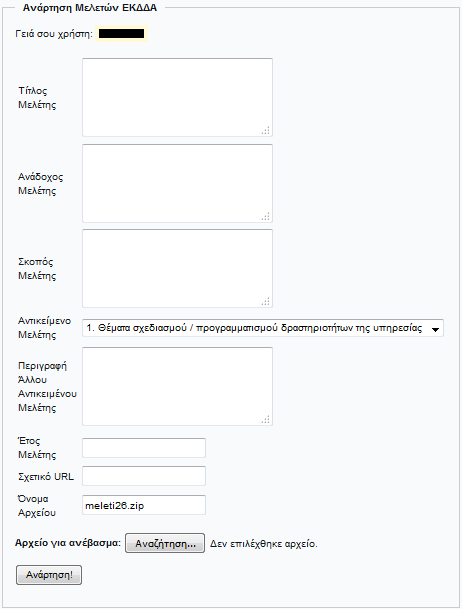

Εικόνα Δ.1.1: Η φόρμα ανάρτησης νέας μελέτης

ΠΑΡΑΡΤΗΜΑ Δ.2: Οδηγός Χρήσης GrabCAD
==================================================================================================================================

Σε αυτό το παράρτημα
περιγράφεται πως κάποιος χρήστης ενός δημοσίου φορέα μπορεί να εγγραφεί
στην υπηρεσία του GrabCAD, να δημιουργήσει ένα έργο και να μεταφορτώσει
περιεχόμενο σε αυτό. Επίσης περιγράφονται τα απαιτούμενα βήματα για τη
συνεργασία πολλών ατόμων σε ένα έργο, καθώς και η συμβολή τρίτων σε
αυτό.

Εγγραφή χρήστη στην ιστοσελίδα της υπηρεσίας
--------------------------------------------

Για να μπορέσετε να χρησιμοποιήσετε την υπηρεσία του ώστε να μπορέσετε
να ανεβάσετε αρχεία τύπου CAD θα πρέπει να δημιουργήστε έναν λογαριασμό
αποκτώντας όνομα χρήστη και κωδικό πρόσβασης. Ανοίξτε τη σελίδα
[https://workbench.grabcad.com/
workbench/register](https://workbench.grabcad.com/%20workbench/register)
ώστε να μεταφερθείτε στη σελίδα εγγραφής χρήστη. Τα ζητούμενα πεδία προς
συμπλήρωση όπως φαίνονται και στην Εικόνα Δ.2.1 είναι τα εξής:

-   «Name» («Όνομα»),

-   «Business Email» («Επαγγελματική Διεύθυνση Ηλεκτρονικού
    Ταχυδρομείου»),

-   «Password» (« Κωδικός πρόσβασης»),

-   «Location» («Τοποθεσία»),

-   «Level» («Θέση»),

-   «Company» («Όνομα Εταιρείας»),

-   «Company Size» («Μέγεθος Εταιρείας»),

-   «Industry Vertical» («Βιομηχανικός Τομέας»),

-   «Phone» («Αριθμός Τηλεφώνου»),

-   «Do you own a 3D printer?» («Κατέχετε έναν 3D εκτυπωτή;»), και

-   «Verify that you are not a robot» («Επιβεβαιώστε ότι δεν
    είστε ρομπότ»).

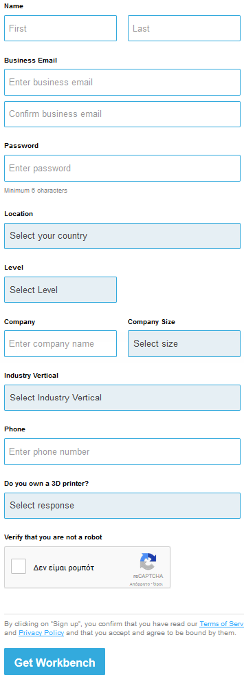

Εικόνα Δ.2.1: Δημιουργία λογαριασμού στο GrabCAD

Πατήστε το κουμπί «Get Workbench» («Απόκτηση του Workbench») και αμέσως
μετά την ολοκλήρωση της εγγραφής σας θα σας αποσταλεί ένα μήνυμα στη
διεύθυνση ηλεκτρονικού ταχυδρομείου που έχετε δηλώσει σχετικά με την
επιβεβαίωση της εγγραφής σας. Θα πρέπει να πατήσετε τον σχετικό σύνδεσμο
που θα βρείτε στο αποσταλμένο μήνυμα ώστε να αποσταλεί αίτημα
ενεργοποίησης του λογαριασμού σας. Άμεσα θα μεταφερθείτε στη σελίδα
διαχείρισης του λογαριασμού σας (Εικόνα Δ.2.2).

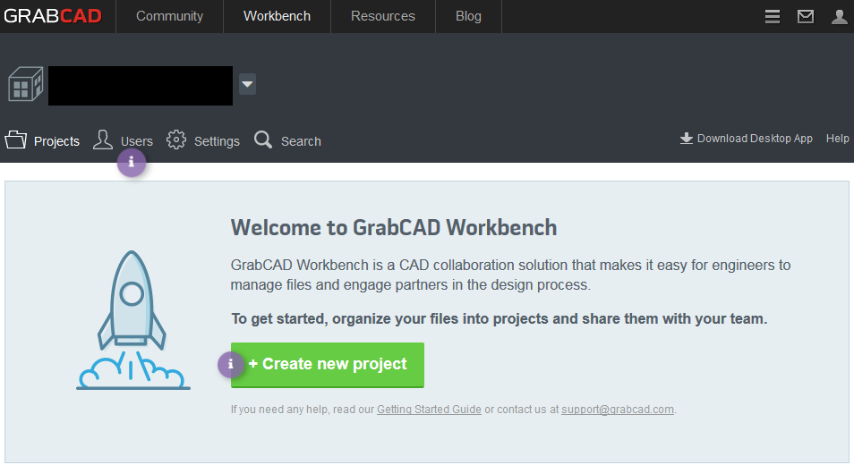

Εικόνα Δ.2.2: Η σελίδα διαχείρισης του λογαριασμού σας

Υπάρχουν δύο τρόποι χρήσης του GrabCAD Workbench, οι οποίοι είναι οι
ακόλουθοι:

-   μέσω περιηγητή ιστού (διαθέσιμο από εδώ: ) μέσω του οποίου
    > παρουσιάζονται όλα τα έργα σας και τα δεδομένα τα οποία έχουν
    > μεταφορτωθεί στο σύννεφο του Workbench. Όλες οι λειτουργίες του
    > Workbench είναι προσβάσιμες μέσω του διαδικτύου.

-   μέσω περιβάλλοντος διεπαφής χρήστη (GUI) (διαθέσιμο από εδώ:
    > <https://workbench.grabcad.com/downloadworkbench>) το οποίο
    > επιτρέπει τον εύκολο συγχρονισμό των τοπικών αρχείων σας με έργα
    > του Workbench. Εκτός αυτού, το πρόσθετο SolidWorks προσφέρει τη
    > δυνατότητα να κλειδώνετε και να ξεκλειδώνετε τα αρχεία σας μέσα
    > αυτού, καθώς και την ικανότητα να δημιουργήσει αυτόματα αρχεία PDF
    > για τα μεταφορτωμένα σχέδιά σας.

Δημιουργία έργου και Μεταφόρτωση αρχείων
--------------------------------------------------------------------------------------------------------------------------------------

Για να μπορέσετε να δημιουργήστε ένα έργο και να μεταφορτώσετε αρχεία σε
αυτό θα πρέπει πρώτα να είστε συνδεδεμένοι στο λογαριασμό σας. Έπειτα
μπορείτε να πατήστε το κουμπί «Create new project» («Δημιουργία νέου
έργου») το οποίο εμφανίζεται στην Εικόνα Δ.2.2. Το παράθυρο διαλόγου της
Εικόνας Δ.2.3 θα εμφανιστεί στο οποίο θα πρέπει να εισάγετε το επιθυμητό
όνομα του έργου σας. Έπειτα πατήστε το κουμπί «Create project»
(«Δημιουργία έργου») και αυτόματα θα μεταφερθείτε στη σελίδα διαχείρισής
του.

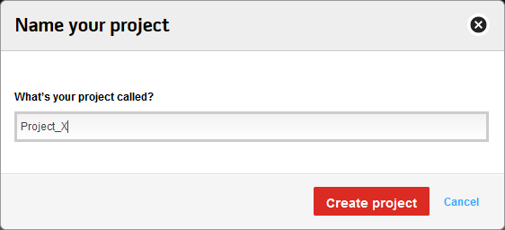

Εικόνα Δ.2.3: Ονομάζοντας ένα νέο έργο

Σε αυτό το εγχειρίδιο θα περιγράψουμε τη μεταφόρτωση αρχείων μέσω του
περιηγητή. Τα βήματα που πρέπει να ακολουθηθούν είναι τα εξής:

1.  Πατήστε το κουμπί «Upload» («Μεταφόρτωση») και επιλέξετε
    «Files» («Αρχεία») το οποίο βρίσκεται στην πάνω αριστερή γωνία της
    σελίδας (Εικόνα Δ.2.4) και ένα παράθυρο θα εμφανιστεί μέσω του
    οποίου μπορείτε να επιλέξετε τα αρχεία σας.

2.  Επιλέξτε ένα ή περισσότερα αρχεία για μεταφόρτωση από τον υπολογιστή
    σας και πατήστε «Άνοιγμα» ή «Open».

3.  Ένα νέο παράθυρο εμφανίζεται μέσω του οποίου μπορείτε να ορίσετε μία
    περιγραφή για τη μεταφόρτωση (Εικόνα Δ.2.4). Όταν η μπλε μπάρα γίνει
    πράσινη πατήστε το κουμπί «Done» («Ολοκλήρωση») και τα αρχεία θα
    εμφανίζονται ως λίστα (Εικόνα Δ.2.5) μαζί με διάφορες πληροφορίες.

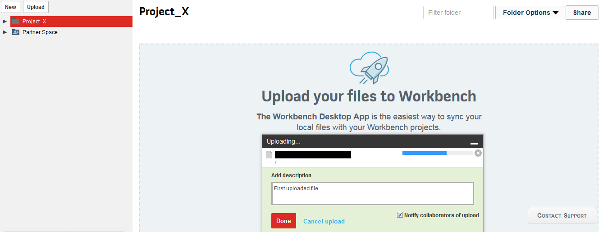

Εικόνα Δ.2.4: Μεταφορτώνοντας ένα νέο αρχείο

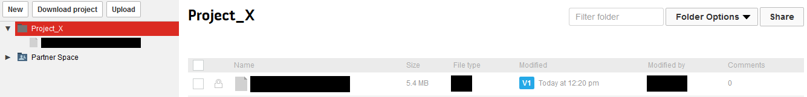

Εικόνα Δ.2.5: Η λίστα των μεταφορτωμένων αρχείων

1.  Σε περίπτωση που θέλετε να μεταφορτώσετε μία νεότερη έκδοση ενός
    αρχείου, εξακολουθήστε τα βήματα 1 και 2 και το μήνυμα της Εικόνας
    Δ.2.6 θα εμφανιστεί. Επιβεβαιώστε την ενημέρωση πατώντας το κουμπί
    «Yes, update version» («Ναι, ενημέρωση την έκδοση») και
    εξακολουθήστε το βήμα 3.

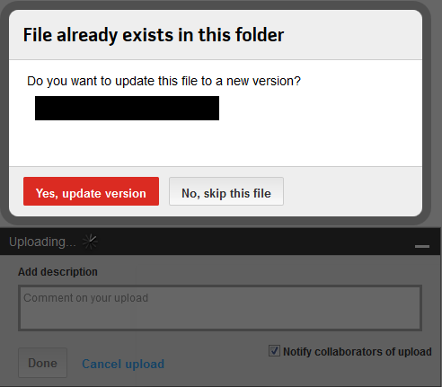

Εικόνα Δ.2.6: Ενημέρωση μεταφορτωμένου αρχείου

1.  Τελικά το αρχείο θα μεταφορτωθεί και το μήνυμα επιβεβαίωσης της
    Εικόνας Δ.2.7 θα εμφανιστεί. Επιπροσθέτως η έκδοση του αρχείου θα
    αλλάξει από «V1» σε «V2».

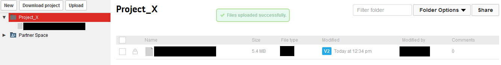

Εικόνα Δ.2.7: Επιβεβαίωση ενημέρωσης αρχείου

1.  Πατώντας πάνω στην έκδοση ενός μεταφορτωμένου αρχείου μπορείτε να
    δείτε το ιστορικό των εκδόσεών του (Εικόνα Δ.2.8). Μία από τις
    προσφερόμενες δυνατότητες είναι η επαναφορά σε κάποια
    παλαιότερη έκδοση.

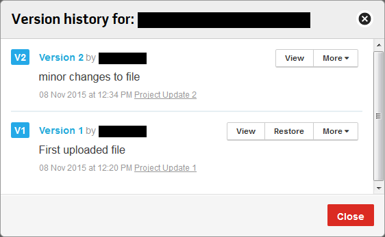

Εικόνα Δ.2.8: Ιστορικό εκδόσεων αρχείου

Αλληλεπίδραση με τρίτους
----------------------------------------------------------------------------------------------------------------------

Ένα από τα μεγάλα χαρακτηριστικά γνωρίσματα του GrabCAD είναι η
δυνατότητα να διαμοιράζεστε το υλικό σας με άλλους ανθρώπους, καθώς και
συνεργάζεστε με αυτούς. Μερικές από τις ενέργειες αλληλεπίδρασης με
τρίτους είναι οι παρακάτω:

-   Πρόσκληση χρηστών στον Workbench λογαριασμό σας, και

-   Πρόσκληση χρηστών σε έργα.

### Πρόσκληση χρηστών στον Workbench λογαριασμό σας

Ως διαχειριστής, μπορείτε να ελέγχετε τους χρήστες στον Workbench
λογαριασμό σας. Αυτό περιλαμβάνει τη δυνατότητα να προσθέτετε χρήστες
και να τους προσθέτετε σε έργα. Για να το επιτύχετε αυτό ακολουθήστε τα
παρακάτω βήματα:

1.  Για να προσθέσετε έναν νέο χρήστη, μεταβείτε στη σελίδα
    > «Users» («Χρήστες») του λογαριασμού σας και πατήστε στο κουμπί
    > «Add new users» («Προσθήκη νέων χρηστών»), όπως φαίνεται στην
    > Εικόνα Δ.2.9.

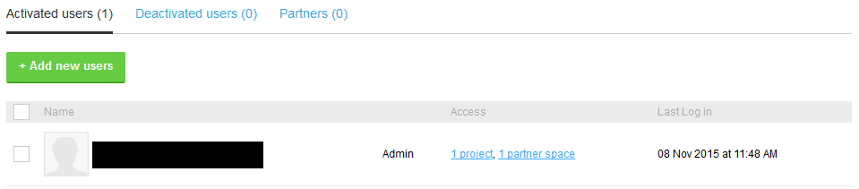

Εικόνα Δ.2.9: Οι χρήστες ενός Workbench λογαριασμού

1.  Το παράθυρο διαλόγου της Εικόνας Δ.2.10 εμφανίζεται. Εκεί θα πρέπει
    > να εισαγάγετε τη διεύθυνση ηλεκτρονικού ταχυδρομείου του χρήστη
    > που θέλετε να προσθέσετε στο λογαριασμό σας.

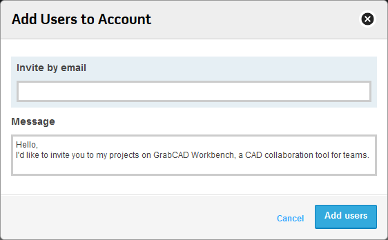

Εικόνα Δ.2.10: Προσθήκη χρήστη σε έναν λογαριασμό

1.  Στο επόμενη βήμα θα πρέπει να επιλέξτε τα έργα στα οποία οι χρήστες
    > θα έχουν πρόσβαση καθώς και τα δικαιώματά τους σε αυτά. Όπως
    > φαίνεται και από την Εικόνα Δ.2.11 υπάρχουν τρεις επιλογές:

    i.  «Collaborator» («Συνεργάτης»), δεν μπορεί να προσκαλέσει
        νέα άτομα.

    ii. «Project Owner» («Ιδιοκτήτης»), μπορεί να προσκαλέσει νέα άτομα.

    iii. «View Only» («Ανάγνωση») ανάγνωση και σχολιασμός μόνο.

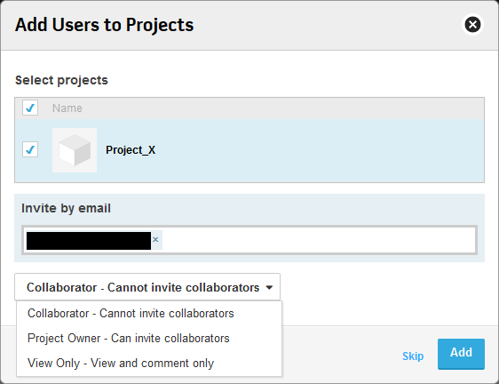

Εικόνα Δ.2.11: Επιλογή έργων και δικαιωμάτων χρήστη σε αυτά

1.  Πατώντας το κουμπί «Add» («Προσθήκη») οι χρήστες του προηγούμενου
    > βήματος προστίθενται στα επιλεγμένα έργα με τα
    > εκχωρημένα δικαιώματα.

### Πρόσκληση χρηστών σε έργα

Οι χρήστες οι οποίοι χρειάζονται πρόσβαση σε όλα τα αρχεία ενός έργου
καθημερινώς μπορούν να προστεθούν στα έργα. Οι χρήστες μπορούν να
προσκληθούν σε ένα έργο με διαφορετικά δικαιώματα. Μετά την προσθήκη
τους στο έργο, οι χρήστες μπορούν να μοιράζονται αρχεία. Για να το
επιτύχετε αυτό ακολουθήστε τα παρακάτω βήματα:

1.  Για να προσθέσετε έναν νέο χρήστη στο έργο μεταβείτε στη σελίδα
    > «Users» («Χρήστες») του έργου σας και πατήστε το κουμπί «Invite
    > Users» («Πρόσκληση Χρηστών»), όπως φαίνεται στην Εικόνα Δ.2.12.

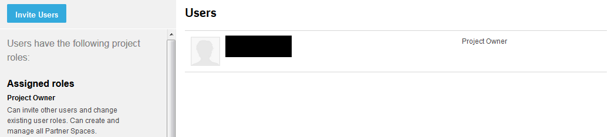

Εικόνα Δ.2.12: Το κουμπί προσθήκης χρηστών σε ένα έργο

1.  Το παράθυρο διαλόγου της Εικόνας Δ.2.13 εμφανίζεται. Εκεί θα πρέπει
    > να εισαγάγετε τη διεύθυνση ηλεκτρονικού ταχυδρομείου του χρήστη
    > που θέλετε να προσκαλέσετε στο έργο σας ή να διαλέξετε κάποιους
    > από την υπάρχουσα λίστα. Επίσης σε αυτό το βήμα διαλέγετε και τα
    > δικαιώματά τους.

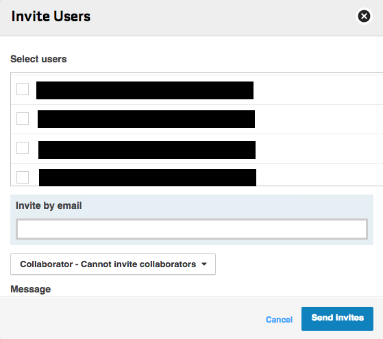

Εικόνα Δ.2.13: Προσθήκη χρηστών σε ένα έργο

1.  Πατώντας το κουμπί «Send invites» («Αποστολή προσκλήσεων») οι
    > χρήστες του προηγούμενου βήματος προσκαλούνται στο συγκεκριμένο
    > έργο με τα εκχωρημένα δικαιώματα.

2.  Πλέον στη σελίδα «Users» («Χρήστες») του έργου σας θα εμφανίζονται
    > όλοι οι προσκεκλημένοι χρήστες με τα εκχωρημένα δικαιώματά τους,
    > όπως παρουσιάζεται στην Εικόνα Δ.2.14.

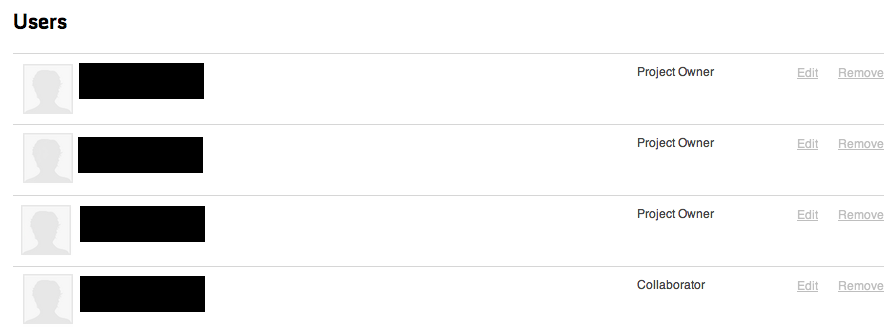

Εικόνα Δ.2.14: Οι χρήστες ενός έργου με τα εκχωρημένα δικαιώματά τους

### Όταν έχετε προσκληθεί σε έναν Workbench λογαριασμό

Σε αυτήν την ενότητα θα περιγραφούν τα βήματα που απαιτούνται όταν έχετε
προσκληθεί σε έναν Workbench λογαριασμό.

1.  Θα λάβετε ένα μήνυμα ηλεκτρονικού ταχυδρομείου, όταν ένας ιδιοκτήτης
    > έργου μοιραστεί έναν λογαριασμό Workbench ή ένα έργο μαζί σας. Η
    > Εικόνα Δ.2.15 παρουσιάζει ένα παράδειγμα ενός μηνύματος
    > ηλεκτρονικού ταχυδρομείου πρόσκλησης σε έναν λογαριασμό.

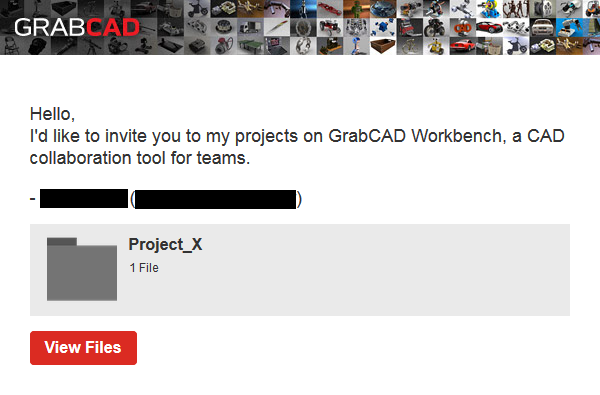

Εικόνα Δ.2.15: Το μήνυμα πρόσκλησης σε έναν λογαριασμό

1.  Για να ξεκινήσετε, μπορείτε να πατήσετε το κουμπί «View Files»
    > («Προβολή Αρχείων»), το οποίο θα σας ανακατευθύνει στο έργο. Εάν
    > έχετε αποσυνδεθεί ή δεν έχετε λογαριασμό GrabCAD θα μεταφερθείτε
    > στη σελίδα σύνδεσης και στην περίπτωση αυτή, μπορείτε να
    > συνδεθείτε ή να εγγραφείτε για να αποκτήσετε πρόσβαση στο έργο.

2.  Μόλις συνδεθείτε, θα μεταφερθείτε στη σελίδα του έργου, όπου
    > μπορείτε να δείτε, να κατεβάσετε και να μεταφορτώστε αρχεία.

